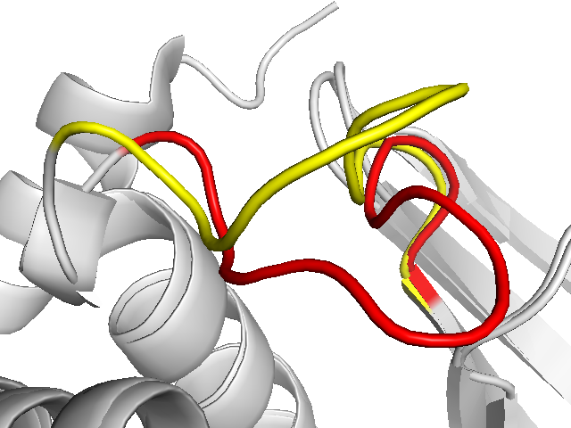
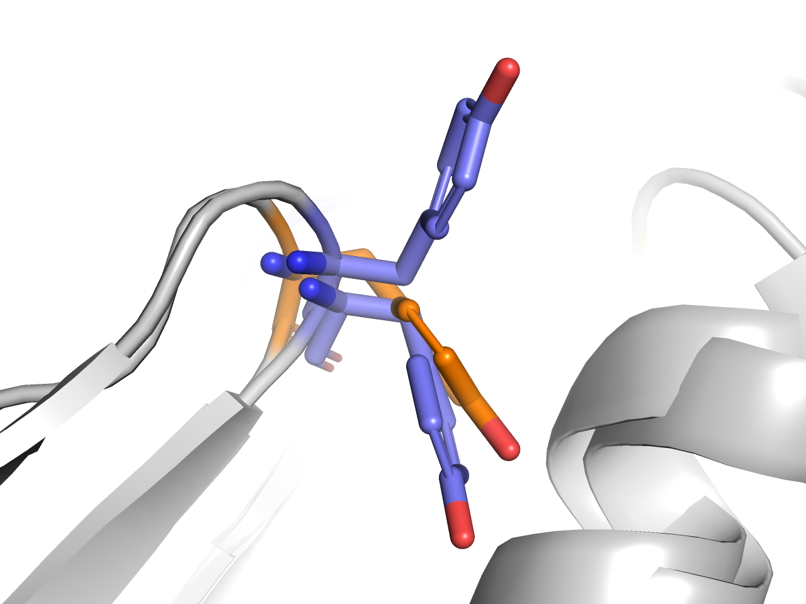
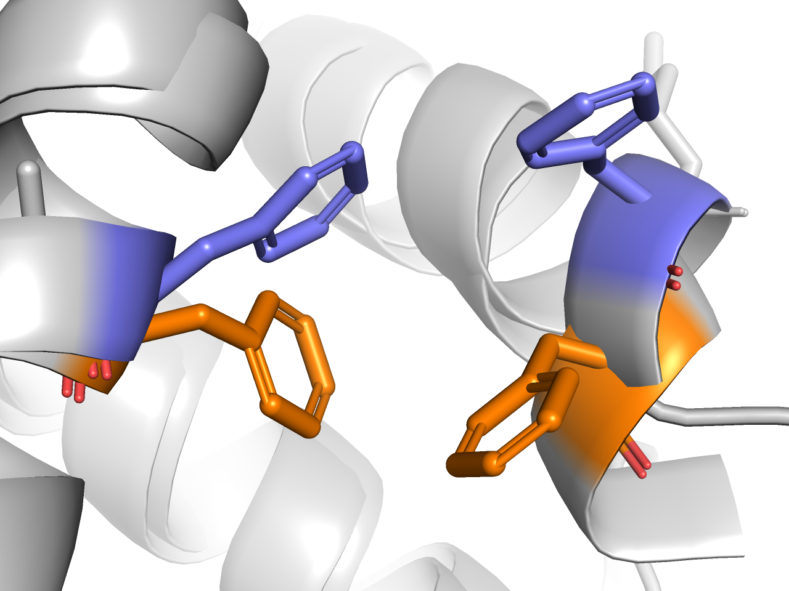

# Steered MD in BioSimSpace

This notebook covers running steered molecular dynamics simulations using BioSimSpace. It includes both using one collective variable (CV) and multiple CVs.

**<span style="color:teal">Reading Time:</span>**
~ 30 mins

### Maintainers
- Adele Hardie -- adele.hardie@ed.ac.uk (@AdeleHardie)

### Prerequisites

- Basic Python and bash
- Basic understanding of protein dynamics

### Learning Objectives

- Set up a steered MD simulation with a single CV
- Set up a steered MD simulation with multiple CVs
- Understand how BSS modifies the standard MD protocol to include a system bias via PLUMED

### Table of Contents
1. [Introduction](#intro)       
2. [Setup sMD](#setup)   
    2.1 [Single CV](#singlecv)     
    2.2 [Multiple CVs](#multicv)    
   
    
### Further reading for this topic
- [Applying sMD to study allosteric modulation](https://www.nature.com/articles/s42004-023-00926-1)

**<span style="color:black">Jupyter Cheat Sheet</span>**
- To run the currently highlighted cell and move focus to the next cell, hold <kbd>&#x21E7; Shift</kbd> and press <kbd>&#x23ce; Enter</kbd>;
- To run the currently highlighted cell and keep focus in the same cell, hold <kbd>&#x21E7; Ctrl</kbd> and press <kbd>&#x23ce; Enter</kbd>;
- To get help for a specific function, place the cursor within the function's brackets, hold <kbd>&#x21E7; Shift</kbd>, and press <kbd>&#x21E5; Tab</kbd>;

### Link to documentation:
You can find the full documentation at [biosimspace.org](https://biosimspace.org).

## 1. Introduction
<div id="intro">

Many relevant biological processes, such as transmembrane permeation or transitions between active and inactive protein conformations, occur on a ${\mu}s$-s timescale. However, even with GPU acceleration, the timescales accessible via molecular dynamics (MD) simulations are only a few hundred ns/day. One of the methods to get around this limitation is steered molecular dynamics (sMD). sMD involves applying a harmonic restraint to bias the system towards a conformation defined through one or more collective variables (CVs):

$V(\vec{s},t) = \frac{1}{2} \kappa(t) ( \vec{s} - \vec{s}_0(t) )^2$     (Eq. 1)

where $\kappa$ is the force constant, $\vec{s}_0$ is the expected CV value at a specific timestep, and $\vec{s}$ is the actual CV value at that timestep.

This section of the tutorial involves using BioSimSpace to set up and run sMD simulations. BSS prepares input files for PLUMED, which is the software that works together with MD engines such as AMBER and GROMACS to add the restraint in eq 1.

The protein that will be used as an example in this tutorial is protein tyrosine phosphatase 1B (PTP1B). It is a negative regulator of insulin signalling\cite and is an attractive target for type II diabetes. The function of PTP1B depends on the conformation of its WPD loop, which can be closed (active, red) or open (inactive, yellow):



The WPD loop of PTP1B opens and closes on a ${\mu}s$ timescale, and therefore this transition is not observed on conventional computational timescales.

## 2. Set up sMD
<div id="setup">

### 2.1 Single CV
<div id="singlecv">

Running steered MD in BioSimSpace is very similar to regular simulations already covered. It only requires some more preparation for interfacing with PLUMED, the software that takes care of biasing the Hamiltonian.

Let's download the inputs for the tutorial if necessary 


```python
from get_tutorial import download
download("01")
```

#### Setting up the system

We start by importing the required libraries:


```python
import BioSimSpace as BSS
import os
from shutil import copyfile
```

Load a system with BioSimSpace. This particular system is of PTP1B with the WPD loop open (from PDB entry 2HNP) and has been minimised and equilibrated.


```python
system = BSS.IO.readMolecules(["data/system.prm7", "data/system.rst7"])
```

#### Creating the CV

Steered MD uses a specific CV, which in this case is RMSD of the WPD loop (residues 178-184). To calculate RMSD, we specify a reference structure first:


```python
reference = BSS.IO.readMolecules("data/reference.pdb").getMolecule(0)
```


```python
rmsd_indices = []
for residue in reference.getResidues():
    if 178 <= residue.index() <= 184:
        for atom in residue.getAtoms():
            if atom.element() != "Hydrogen (H, 1)":
                rmsd_indices.append(atom.index())
```


```python
rmsd_cv = BSS.Metadynamics.CollectiveVariable.RMSD(system, reference, rmsd_indices)
```

#### Setting up a steered MD protocol

To create a protocol, we need to set up the steering restraints and schedule. As shown in equation 1, steered MD is defined by the expected CV value and the force constant &kappa; at some time *t*. Generally sMD has four stages:

| Stage          | Expected end CV | Force constant  |
| -------------- | --------------- | --------------- |
| 1. start       | initial value   | none            |
| 2. apply force | initial value   | specified force |
| 3. steering    | target value    | specified force |
| 4. relaxation  | target value    | none            |

Force is usually applied over a few picoseconds, and the bulk of the simulation is used for steering, i.e. stage 3. We need to specify the end times for these stages:


```python
start = 0 * BSS.Units.Time.nanosecond
apply_force = 4 * BSS.Units.Time.picosecond
steer = 150 * BSS.Units.Time.nanosecond
relax = 152 * BSS.Units.Time.nanosecond
```


```python
schedule = [start, apply_force, steer, relax]
```

The restraints specify the expected CV value and the force constant ($\kappa(t)$ and $\vec{s}_0(t)$) at each step created above.


```python
nm = BSS.Units.Length.nanometer
restraint_1 = BSS.Metadynamics.Restraint(rmsd_cv.getInitialValue(), 0)
restraint_2 = BSS.Metadynamics.Restraint(rmsd_cv.getInitialValue(), 3500)
restraint_3 = BSS.Metadynamics.Restraint(0 * nm, 3500)
restraint_4 = BSS.Metadynamics.Restraint(0 * nm, 0)
```


```python
protocol = BSS.Protocol.Steering(
    rmsd_cv,
    [start, apply_force, steer, relax],
    [restraint_1, restraint_2, restraint_3, restraint_4],
    runtime=152 * BSS.Units.Time.nanosecond,
)
```

#### A quick look at GROMACS

We have previously created a protocol for sMD, so all that is needed is to plug it into a GROMACS process


```python
process = BSS.Process.Gromacs(
    system,
    protocol)
```

We can have a look at the command arguments that will be used to run this simulation:


```python
process.getArgs()
```

The argument `-plumed plumed.dat` tells GROMACS to use PLUMED, looking at the `plumed.dat` file for instructions. This process can be run like any other process you have seen before. All the required files have been created in the `process.workDir()` by BioSimSpace.

#### Steered MD in AMBER

Just as with GROMACS, we simply need to create a process in AMBER. If you have access to pmemd.cuda use of this engine can be specified by passing the keyword argument exe=f'{os.environ["AMBERHOME"]}/bin/pmemd.cuda'.


```python
process = BSS.Process.Amber(
    system, protocol)
```

Check the configuration of the process:


```python
process.getConfig()
```

The lines `plumed=1` and `plumedfile="plumed.in"` are what specify that PLUMED will be used. The process can now be started to run steered MD.

For convenience, we provide a python script in `scripts/sMD_simple.py`, which will work for any system using a single RMSD CV. Additionally, `scripts/sMD_slurm.sh` and `scripts/sMD_LFS.sh` show how the python scripts using BSS can be executed using schedulers for HPC clusters.

### 2.2 Multiple CVs
<div id="multiplecvs">

The above setup example uses one collective variable - the RMSD of the WPD loop. However, there may be need for more complicated steering protocols, involving multiple CVs. Below we set up an sMD protocol using the previous rmsd CV, but also adding a torsion and a distance CVs.

#### Torsion CV

We will be adding the $\chi$ 1 angle of Tyr152 to the steering protocol. Tyr152 is suggested to be part of the PTP1B allosteric network. When the WPD loop is open (blue), it exists in both "up" and "down" rotamers, but when it is closed (orange), Tyr152 exists in the "down" rotamer only.




```python
torsion_indices = []
for atom in system.getMolecule(0).getResidues()[152].getAtoms():
    if atom.name() in ["N", "CA", "CB", "CG"]:
        torsion_indices.append(atom.index())
```


```python
torsion_cv = BSS.Metadynamics.CollectiveVariable.Torsion(torsion_indices)
```

#### Distance CV

Another component of the allosteric network of PTP1B is the stacking of Phe196 to Phe280. These residues are $\pi$-stacked when the WPD loop is closed (orange) and apart when it is open (blue).



This stacking will be expressed as the distance between the C$\gamma$ atoms the the residues.


```python
distance_indices = []
for residue in system.getMolecule(0).getResidues():
    if residue.index() == 196 or residue.index() == 280:
        for atom in residue.getAtoms():
            if atom.name() == "CG":
                distance_indices.append(atom.index())
                break

distance_cv = BSS.Metadynamics.CollectiveVariable.Distance(
    distance_indices[0], distance_indices[1]
)
```

#### Creating the protocol

The restraints now have to include target values for all CVs involved at each point in the schedule.


```python
nm = BSS.Units.Length.nanometer
rad = BSS.Units.Angle.radian
```


```python
restraints = [
    [
        BSS.Metadynamics.Restraint(rmsd_cv.getInitialValue(), 0),
        BSS.Metadynamics.Restraint(1.1 * rad, 0),
        BSS.Metadynamics.Restraint(0.56 * nm, 0),
    ],  # initial
    [
        BSS.Metadynamics.Restraint(rmsd_cv.getInitialValue(), 3500),
        BSS.Metadynamics.Restraint(1.1 * rad, 3500),
        BSS.Metadynamics.Restraint(0.56 * nm, 3500),
    ],  # apply force
    [
        BSS.Metadynamics.Restraint(0 * nm, 3500),
        BSS.Metadynamics.Restraint(1.1 * rad, 3500),
        BSS.Metadynamics.Restraint(0.4 * nm, 3500),
    ],  # steering
    [
        BSS.Metadynamics.Restraint(0 * nm, 0),
        BSS.Metadynamics.Restraint(1.1 * rad, 0),
        BSS.Metadynamics.Restraint(0.4 * nm, 0),
    ],
]  # release force
```

When creating the `protocol`, all CVs are passed as a list:


```python
protocol = BSS.Protocol.Steering(
    [rmsd_cv, torsion_cv, distance_cv],
    schedule,
    restraints,
    runtime=relax,
    report_interval=2500,
    restart_interval=2500,
)
```


```python
# pass exe=f'{os.environ["AMBERHOME"]}/bin/pmemd.cuda to use the faster MD engine pmemd
process = BSS.Process.Amber(
    system, protocol)
```

We can check the contents of the PLUMED file that BioSimSpace has created:


```python
for line in process.getPlumedConfig():
    print(line)
```

The `ARG` line specifies 3 CVs, which will all be used for steering.

The process can be run with `process.start()`

<div class="alert alert-info"><b>Note:</b> The trajectory analysis is covered in the next notebook</div>

As with the single CV protocol, there is a sample script in `scripts/sMD_multiCV.py`. Because of the multiple CVs used the script is specific to PTP1B, but it can be easily adapted to other systems by changing CV types or residue numbers.

⚠️ BioSimSpace only includes RMSD, torsion and distance CVs. For more complex steering protocols, you can either use [PLUMED](https://www.plumed.org/doc-v2.8/user-doc/html/_m_o_v_i_n_g_r_e_s_t_r_a_i_n_t.html) directly, or see [AMMo](https://github.com/michellab/AMMo/tree/main/examples/example_ptp1b) for a more flexible but still slightly automated approach using pseudo-PLUMED files.
