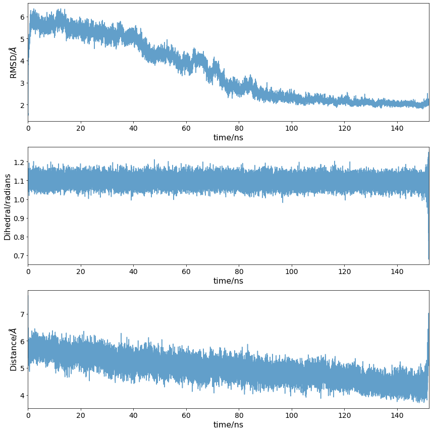
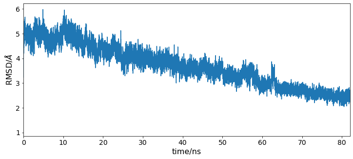
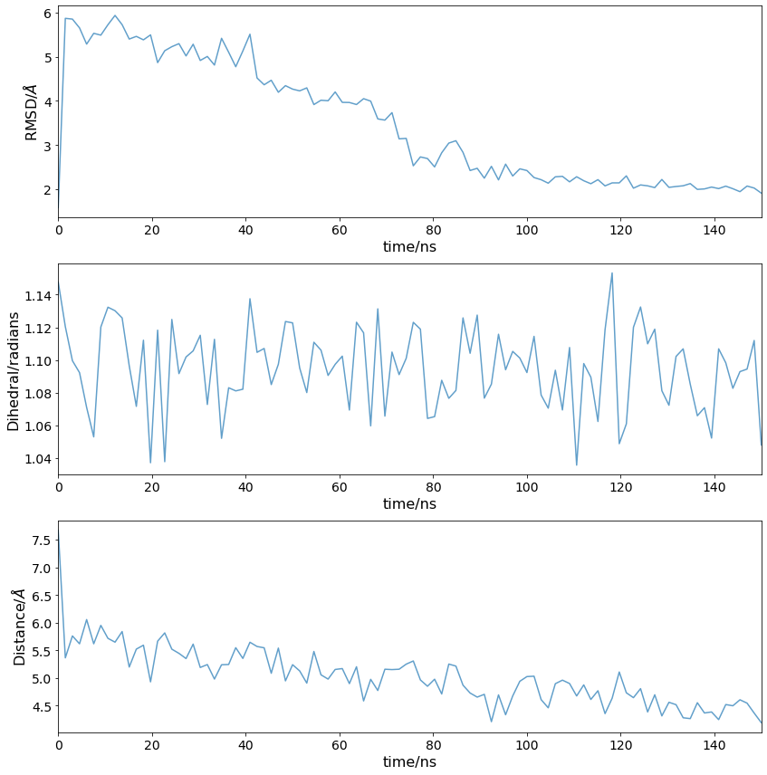
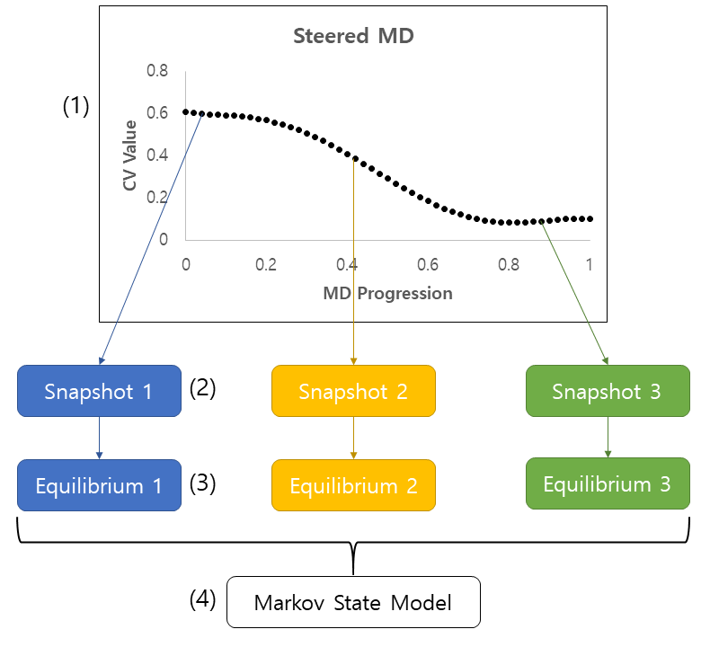

# Steered MD in BioSimSpace

This notebook covers analysing sMD trajectories after the run has finished.

**<span style="color:teal">Reading Time:</span>**
~ 15 mins

### Maintainers
- Adele Hardie -- adele.hardie@ed.ac.uk (@AdeleHardie)

### Prerequisites

- Basic Python and bash
- A completed sMD run

### Learning Objectives

- Analyse the steered MD trajectory

### Table of Contents
1. [Introduction](#intro)       
2. [Plot steering output](#plotting)<br>
    2.1 [Successful steering](#success)<br>
    2.2 [Failed steering](#failed)     
3. [Extract snapshots](#snapshots)
4. [Example application - Markov State Modelling](#msm)
   
    
### Further reading for this topic
- [Applying sMD to study allosteric modulation](https://www.nature.com/articles/s42004-023-00926-1)

**<span style="color:black">Jupyter Cheat Sheet</span>**
- To run the currently highlighted cell and move focus to the next cell, hold <kbd>&#x21E7; Shift</kbd> and press <kbd>&#x23ce; Enter</kbd>;
- To run the currently highlighted cell and keep focus in the same cell, hold <kbd>&#x21E7; Ctrl</kbd> and press <kbd>&#x23ce; Enter</kbd>;
- To get help for a specific function, place the cursor within the function's brackets, hold <kbd>&#x21E7; Shift</kbd>, and press <kbd>&#x21E5; Tab</kbd>;

### Link to documentation:
You can find the full documentation at [biosimspace.org](https://biosimspace.org).

## 1. Introduction
<div id="intro">

The purpose of the steered MD simulation is to access conformational space that would take a very long time (or be inaccessible altogether) at equilibrium. We can check whether the desired conformational change occured by analysing the output CV data.

Let's download the inputs for the tutorial if necessary


```python
from get_tutorial import download
download("01")
```

Start by importing required libraries:


```python
import pandas as pd
import numpy as np
import matplotlib.pyplot as plt
import BioSimSpace as BSS
import os
```

## 2. Plot steering output
<div id="plot">

### 2.1 Successful steering
<div id="success">

PLUMED outputs a file with the CV value that was used for steering, so we can see the progression during the simulation. The file is automatically named `COLVAR` by BioSimSpace. Here it is loaded as a pandas dataframe.


```python
steering_output_file = "data/COLVAR"
df = pd.read_csv(steering_output_file, sep=" ")
cols = list(df.columns[2:])
df = pd.read_csv(steering_output_file, sep=" ", comment="#", names=cols)
```


```python
df.head()
```

The `COLVAR` file contains all of the CV values (`r1,t1,d1`), as well as more information on the force applied and work done.

PLUMED outputs time in picoseconds and RMSD in nanometers. For easier plotting, we change time to nanoseconds and distances to Angstrom.


```python
df["time"] = df["time"] / 1000
df["r1"] = df["r1"] * 10
df["d1"] = df["d1"] * 10
df.set_index("time", inplace=True)
```

Now the CV changes can be plotted:


```python
fig, ax = plt.subplots(3, figsize=(12, 12))

columns = ["r1", "t1", "d1"]
ylabels = ["RMSD/$\AA$", "Dihedral/radians", "Distance/$\AA$"]

for i in range(len(columns)):
    ax[i].plot(df.index, df[columns[i]], alpha=0.7)
    ax[i].set_ylabel(ylabels[i])
    ax[i].set_xlabel("time/ns")
    ax[i].set_xlim(0, 152)

fig.tight_layout()
```



Here the loop RMSD went down to below 2 A (around 1.8 A). This indicates that the loop conformation was very similar to the crystal structure of PTP1B with the loop closed (which was used as the target) and so we can proceed with extracting snapshots to use as seeds. Additionally, the Tyr152 $\chi$1 angle was kept in the "down" rotamer consistently (around 1.1 radians) and the Phe196(C$\gamma$)-Phe280(C$\gamma$) distance was decreased to 4 A, which corresponds to the two residues $\pi$-stacking.

### 2.2 Failed steering
<div id="failed">

However, sMD might not work on the first try - the steering duration and force constant used is highly dependent on each individual system. Below is an example of a failed WPD loop RMSD steering attempt:



Here steering was carried out for 80 ns only, and the force constant used was 2500 kJ mol$^{-1}$. The RMSD was decreasing as expected, but didn't go below 2 A. This was deemed insufficient and a longer steering protocol with a larger force constant was decided upon in the end. Ultimately this will depend on the system you are working with and what the goal of the steering is.

## 3. Extract snapshots
<div id="snapshots">

There are multiple possible applications of sMD. Here we illustrate the enhanced sampling of conformational space, to study the conformational ensemble of PTP1B and how it may be perturbed by ligands (i.e. allosteric modulators). The sMD trajectory reaches not only active and inactive states of PTP1B, but also the short-lived intermediate conformations. We use these as seeds for further MD simulations, which are then combined in a Markov State Model. This allows to model the probability of protein active states.

In this case we will be extracting 100 evenly spaced snapshots to be used as starting points for the seeded MD simulations.


```python
download("02")
snapshot_dir = "data"
if not os.path.exists(snapshot_dir):
    os.mkdir(snapshot_dir)
```

Get frame indices for snapshots. Note that the end point selected is not the end of the simulation, but the end of the steering part.

We have provided an example steered MD trajectory in `data/steering.nc`. For ease of downloading, it has been significantly cut down, with each frame corresponding to 0.5 ns, while it is more common to save trajectories every 5-10 ps. This is reflected in dividing the duration in ns by the frame rate in ns below.


```python
number_of_snapshots = 100
end = 150 / 0.5
frames = np.linspace(0, end, number_of_snapshots, dtype=int)
```

Check that the snapshots roughly evenly sample the CVs:


```python
fig, ax = plt.subplots(3, figsize=(12, 12))

columns = ["r1", "t1", "d1"]
ylabels = ["RMSD/$\AA$", "Dihedral/radians", "Distance/$\AA$"]

for i in range(len(columns)):
    ax[i].plot(df.index[frames]*100, df.iloc[frames][columns[i]], alpha=0.7)
    ax[i].set_ylabel(ylabels[i])
    ax[i].set_xlabel("time/ns")
    ax[i].set_xlim(0, 150)

fig.tight_layout()
```



Save each snapshot as a restart file (note: this will take several minutes):


```python
for i, index in enumerate(frames):
    frame = BSS.Trajectory.getFrame(
        trajectory="data/steering.nc",
        topology="data/system.prm7",
        index=int(index),
    )
    BSS.IO.saveMolecules(f"{snapshot_dir}/snapshot_{i+1}", frame, "rst7")
```

These .rst7 files are to be used as starting points for 100 individual 50 ns simulations, starting with resolvation, minimisation and equilibration. This is very time consuming and best done on an HPC cluster. An [example script](scripts/seededMD.py) that can be used with an array submission is provided.

<div class="alert alert-info"><b>Note:</b> Since the .rst7 files are of the original system, the same topology is reused throughout</div>

## 4. Example application - Markov State Modelling
<div id="msm">

There are multiple potential applications, such as studying membrane permeability or ligand residence time. Another use is for the additional exploration of conformational space for predicting allosteric modulation using Markov State Models (MSMs). There is a lot to consider when building MSMs, and the method is not covered in this tutorial. Here the python library [PyEMMA](http://emma-project.org/latest/) was used, which has extensive examples and documentation. The integration of sMD in this allosteric modulation prediction workflow is illustrated below:



[Hardie *et al*](https://www.nature.com/articles/s42004-023-00926-1) report a detailed study of allosteric modulators of PTP1B using this sMD/MSM methodology with notebooks for the PTP1B case study available on [GitHub](https://github.com/michellab/AMMo/tree/main/examples/example_ptp1b).
