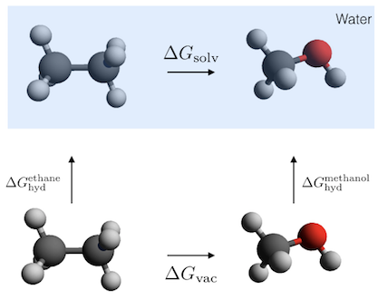
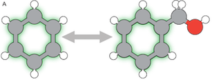
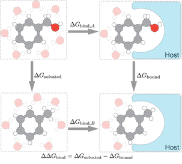
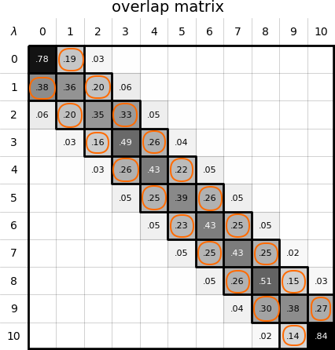
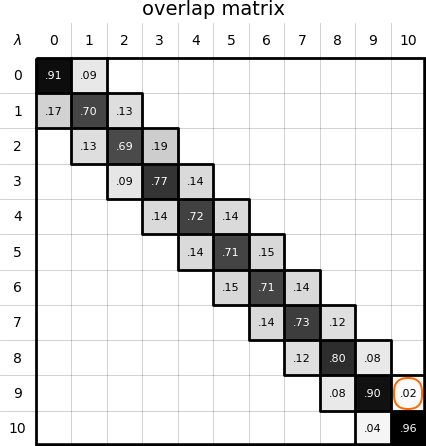

# An Introduction to setting up alchemical free energy calculations

This Jupyter notebook is an introduction alchemical free energy methods with BioSimSpace.

This notebook includes core as well as <span style="color:teal">extra</span> options. These extra sections are there to include some more functionality for when the concepts of these tutorials are applied to your own work.  

**<span style="color:teal">Reading Time:</span>**
~ 30 mins

### Maintainers
- [Finlay Clark -- @fjclark](https://github.com/fjclark)
- [Anna Herz -- @annamherz](https://github.com/annamherz)

See [README.md](https://github.com/michellab/BioSimSpaceTutorials/blob/main/04_fep/README.md) for complete list of authors.

### Prerequisites
 - Basic Python
 - Presentation slides : [Alchemical Free Energy Methods with BioSimSpace</span>](slides/CCPBioSimTraining2022_slides.pdf) and [talk video](https://www.youtube.com/watch?v=RSG8y9RzArI) (from the 2022 CCPBioSim Training Week).

### Learning Objectives
- Setup an alchemical solvation free energy simulation using BioSimSpace and SOMD
- Setup an alchemical solvation free energy simulation using BioSimSpace and Gromacs
- Setup an alchemical binding free energy simulation for Gromacs and SOMD using BioSimSpace

You will be using the following functions in BioSimSpace:

- `BSS.IO.readMolecules()` To load the molecules
- `BSS.Parameters.gaff` To parameterise molecules using the Generalised Amber Force Field (GAFF)
- `BSS.Parameters.ff14SB` To parameterise a protein using FF14SB
- `BSS.Align.matchAtoms()` Maximum Common Substructure matches atoms for the morphing
- `BSS.Align.rmsdAlign()` Aligns the molecules to be morphed
- `BSS.Align.merge()` Creates a merged molecule used for alchemical simulations
- `BSS.Solvent.tip3p()` Solvates a molecule in a tip3 water box
- `BSS.Protocol.FreeEnergy()` Defines the free energy protocol
- `BSS.FreeEnergy.Relative()` Sets up a leg for a relative free-energy simulation
- `BSS.FreeEnergy.Relative.analyse()` To analyse the results of the perturbation

### Table of Contents
1. [Working with ligands](#lig)    
   1.1 [Loading ligands](#load)   
   1.2 [Parametrising ligands](#param)   
2. [Morphing ligands](#merge)   
   2.1 [Maximum common substructure (MCS)](#mcs)     
   2.2 [Creating a _merged_ molecule](#merged)   
   2.3 [Solvation](#solv)  
   2.4 [Reading and writing perturbable systems](#readwrite)   
3. [Running a solvation free energy simulation](#free)   
   3.1 [Exercises for solvation free energies](#exerc2)   
4. [Binding free energy simulation](#bind)   
   4.1 [Loading the protein and ligands](#prot)   
   4.2 [Paramaterising a protein](#paramp)   
   4.3 [Morphing again](#morphp)   
   4.4 [Running the binding free energy simulation](#runbind)   
   4.5 [Exercises](#exerc3)    
5. [Analysis](#ana)    
   5.1 [Calculating the RBFE between a pair of ligands](#mbar)   
   5.2 [Overlap](#over)    
   5.3 [Extra Exercises](#exerc5)    

### Further reading for this topic
- [LiveComs Best Practices for Alchemical Free Energy Calculations](https://livecomsjournal.org/index.php/livecoms/article/view/v2i1e18378).

**<span style="color:black">Jupyter Cheat Sheet</span>**
- To run the currently highlighted cell and move focus to the next cell, hold <kbd>&#x21E7; Shift</kbd> and press <kbd>&#x23ce; Enter</kbd>;
- To run the currently highlighted cell and keep focus in the same cell, hold <kbd>&#x21E7; ctrl</kbd> and press <kbd>&#x23ce; Enter</kbd>;
- To get help for a specific function, place the cursor within the function's brackets, hold <kbd>&#x21E7; Shift</kbd>, and press <kbd>&#x21E5; Tab</kbd>;
- You can find the full documentation at [biosimspace.org](https://biosimspace.org).

You can use `!` to access terminal commands: e.g. `! head -n 20 myfilename.dat` will display the first 20 lines of a file. 


### Exercises
Exercises are announced using an alert alert-success box in this way:
<div class="alert alert-success">
<b>Exercise 1.1: Write a function that computes bond lengths:</b>
</div>
and followed by an incomplete cell. All exercises should be numbered. 
Missing parts are indicated by:

```python
#FIXME
```
These are included whilst running through the workshops and also in dedicated sections.   


## Let's get started

First, let's import BioSimspace!


```python
from get_tutorial import download
import BioSimSpace as BSS
```


    


    INFO:rdkit:Enabling RDKit 2023.03.2 jupyter extensions


## 1. Free energy of solvation of ethane and methanol
<a id="lig"></a>

We want to compute the relative free energy of hydration between ethane and methanol, $\Delta \Delta G_{\mathrm{hyd,\: ethane-methanol}}$. This is the free energy difference between hydrating an ethane molecule in water and a methanol molecule in water.

Below you can see a thermodynamic cycle for the relative hydration free energy of ethane and methanol:



Because free energy is a state function, the total free energy change around the cycle is 0:

$\Delta G^{\mathrm{ethane}}_{\mathrm{hyd}} + \Delta G_{\mathrm{solv}} - \Delta G^{\mathrm{methanol}}_{\mathrm{hyd}} -  \Delta G_{\mathrm{vac}} = 0$

This allows us to obtain $\Delta \Delta G_{\mathrm{hyd,\: ethane-methanol}}$ in terms of $\Delta G_{\mathrm{solv}}$ and $\Delta G_{\mathrm{vac}}$:

$\Delta G^{\mathrm{methanol}}_{\mathrm{hyd}}  - \Delta G^{\mathrm{ethane}}_{\mathrm{hyd}} = \Delta G_{\mathrm{solv}} - \Delta G_{\mathrm{vac}}$

$\Delta \Delta G_{\mathrm{hyd,\: ethane-methanol}} = \Delta G_{\mathrm{solv}} - \Delta G_{\mathrm{vac}}$

Now we just need to compute these quantities using alchemical simulations.

### 1.1 Loading ligands
<a id="load"></a>
Next, we read in the two molecules we want to perturb. In this case, this is ethane changing to methanol. You can use the BioSimSpace function `BSS.IO.readMolecules()` for this task.

Let's download the required inputs if necessary


```python
download("01")
```


```python
# We assume the molecules to perturb are the first molecules in each system. (Each file contains a single molecule.)
# we use [0] to select this first molecule.
ethane = BSS.IO.readMolecules("input/ethane.pdb")[0]
methanol = BSS.IO.readMolecules("input/methanol.pdb")[0]
```

<div class="alert alert-info">
<b>Note:</b> To check whether we have selected an atom/molecule/system, a quick check is to print the object, which will tell us which <code>BSS</code> type the object has.
</div>


```python
print(ethane)
print(methanol)
```

The below cell illustrates the automatic instantiation of `BSS` objects further - if we do not select the first molecule when we load our system in, even if there is only one molecule in the file, this will be instantiated as a system as a default. Similarly, if we combine molecules it automatically changes the `BSS` type of the object.


```python
test_ethane_system = BSS.IO.readMolecules("input/ethane.pdb")
print(test_ethane_system)
test_combined = (ethane + methanol)
print(test_combined)
```

Apart from just the type of the BSS object, it might also be nice to quickly check we are reading in the right molecules so we can visualise them using the `View` class from `BSS.Notebook`. This uses NGLView.

With the default settings, we should be able to visualise our molecule. Some useful tips for navigating the view are:
- left click, hold and drag to spin the molecule
- right click, hold and drag to pan
- use the mouse wheel to zoom in and out
- center on the molecule again by going to the 'View' menu on the top tool bar and clicking on 'center' .


```python
BSS.Notebook.View("input/ethane.pdb").system()
```


```python
BSS.Notebook.View("input/methanol.pdb").system()
```

### 1.2 Paramaterising Molecules
<a id="param"></a>

Current we only have the coordinates information saved for the loaded molecules so the first thing we need to do is generated some forcefield parameters. In this case, we will use the Generalise Amber Force Field [(GAFF)](http://ambermd.org/antechamber/gaff.html).


```python
ethane = BSS.Parameters.gaff(ethane).getMolecule()
methanol = BSS.Parameters.gaff(methanol).getMolecule()
```

## 2. Creating merged system
<a id="merge"></a>
Now ethane and methanol have all the required properties for running an MD simulation of them individually. But here we are interested in creating a morphed system, or `single topology` for running an alchemical free energy calculation. In this case, two of the ethane hydrogens will turn into dummy atoms and the second carbon and the 3rd hydrogen will turn into the `OH` group of the methanol.

There are different topologies, and which is used, single or dual, depends largely on the software. For more information, check the further reading: [Section 7.1.1 (Topologies), LiveComs Best Practices for Alchemical Free Energy Calculations](https://livecomsjournal.org/index.php/livecoms/article/view/v2i1e18378).

### 2.1 Maximum Common Substructure (MCS)
<a id="MCS"></a>
In order to automatically figure out which atoms are common between ethane and methanol we can use the `matchAtoms()` function of BioSimSpace. This will compute a maxmimum common substructure (MCS) match and return a dictionary that maps the indices of atoms in the ethane molecule to the indices of the atoms in the methanol to which they match. An example of what and MCS match might look like is shown here:




```python
mapping = BSS.Align.matchAtoms(ethane, methanol)

# Mapping is a dictionary mapping atom indices in ethane to those in methanol.
print(mapping)
```

Once we have the mapping we can align the molecules to each other using a root mean squared displacement (RMSD) metric and from the alignment we can then create a merged molecule which contains all of the `single topology` information needed for the alchemical perturbation.

To visualise the mapping we can use:


```python
BSS.Align.viewMapping(ethane, methanol, mapping)
```

This shows ethane, with the atoms that map to those in methanol highlighted in green. The numbers next to the atoms are their indices within the molecule (and mapping dictionary).To instead use methanol as the reference, we can swap the order of the molecules that are passed to the function and invert the mapping dictionary:


```python
# get the inverse mapping
inv_mapping = {v: k for k, v in mapping.items()}
```

<div class="alert alert-success">
<b>Exercise 2.1.1: Visualise the inverse mapping. How is it different from the previous mapping?</b>
</div>


```python
#FIXME
```

<details><summary {style='color:green;font-weight:bold'}> Click here to see solution to Exercise. </summary>

```Python
BSS.Align.viewMapping(methanol, ethane, inv_mapping)
```

</details>

### 2.2 Creating a _merged_ molecule
<a id="merged"></a>

In order to perform an alchemical simulation we need to create a _merged_ molecule that combines that properties of the two molecules. To do so we first need to align one molecule to the other, based on the mapping. This can be achieved using the `rsmdAlign` function.    
As the mapping matches the atoms for ligand 0 (ethane) to ligand 1 (methanol), and we want to align ligand 1 to ligand 0 (so align the methanol to the ethane), we need to use the inverse mapping for this:


```python
# Align methanol to ethane based on the inverse mapping.
methanol_aligned = BSS.Align.rmsdAlign(methanol, ethane, inv_mapping)
```

We can now _merge_ the two molecules. This will create a composite molecule containing all of the molecular properties at both end states. If the molecules are a different size, then the smaller will contain dummy atoms to represent the atoms that will _appear_ during the perturbation. In this case, the merged methanol end state will contain two dummy atoms corresponding to the extra hydrogen atoms in the ethane molecule.


```python
# Merge the ethane and methanol based on the mapping.
merged = BSS.Align.merge(ethane, methanol_aligned, mapping)
```

### 2.3 Solvation
<a id="solv"></a>

Before we can run a free energy simulation we will have to solvate the system. In this case, rather than passing ethane and methanol separately we will solvate the whole merged system. Here we use a cubic box with a base length of 40 Angstroms.


```python
solvated = BSS.Solvent.tip3p(molecule=merged, box=3*[40*BSS.Units.Length.angstrom])
```

You can see which solvation models are available in BSS by running `print(BSS.Solvent.waterModels())` .

We may also want to visualise the solvated system. However, as our merged molecule is a perturbable molecule, must must first be converted to one of the endstates so that we can view it. This is handled automatically by `View`, but it is important to be aware that the molecule shown only represents our ligand at $\lambda=0$.   

As the water is obscuring our ligand, we can use the selection language `not water` to only show our ligand. This is entered next to the filter icon in our viewer.


```python
BSS.Notebook.View(solvated).system()
```

### 2.4 Reading and writing perturbable systems
<a id="readwrite"></a>

You might wish to save a perturbable system to file for use in a future simulation, or to share with a colleague. To do so you can use the `BioSimSpace.IO.savePerturbableSystem` function. This writes the topology and coordinate files for the two end states, which can be read back to reconstruct the system. For example:


```python
BSS.IO.savePerturbableSystem("pert", solvated)
```

There should now be four new AMBER format files in your working directory:


```python
! ls pert*
```

Here `pert0.prm7` and `pert1.prm7` are the topology files for the two end states and `pert0.rst7` and `pert1.rst7` are the coordinates. To re-load the files we can use:


```python
solvated = BSS.IO.readPerturbableSystem("pert0.prm7", "pert0.rst7", "pert1.prm7", "pert1.rst7")
```

## 3. Solvation free energy
<a id="free"></a>
We now need to define a protocol to describe the parameters used for the free energy perturbation. A simple protocol consists of a 2 fs timestep, a runtime of 4 ns and using 9 equally spaced $\lambda$ windows:


```python
protocol = BSS.Protocol.FreeEnergy(timestep=2*BSS.Units.Time.femtosecond, runtime=4*BSS.Units.Time.nanosecond, num_lam=9)
```

Next we want to create objects to configure and run the two legs associated with the relative free-energy perturbation calculation:


```python
fep_free = BSS.FreeEnergy.Relative(solvated, protocol, work_dir="ethane_methanol_somd/free")
fep_vac  = BSS.FreeEnergy.Relative(merged.toSystem(), protocol, work_dir="ethane_methanol_somd/vacuum")
```

Decoupling the two legs means that we can use a different protocol for each, e.g. less lambda windows for the vacuum leg, or re-use data from a leg in an entirely different calculation, e.g. for a binding free-energy simulation, or to combine results for legs that were run with entirely simulation engines, e.g. SOMD or GROMACS.

To run simulations for all of the individual lambda windows for the free leg, you can use:

`fep_free.run()`   

If you want to start the simulation, but wait for it to finish before the next part of code is executed (i.e. the analysis), you can use the following:

`fep_free.wait()`   

This only makes sense on a workstation with GPUs or GPU cloud resources or a GPU cluster. Otherwise you will have to wait for too long to run these simulations on the notebook server.

Let's have a look the `ethane_methanol_somd/free` directory. In this directory you have now all the files setup and ready for simulation using SOMD as the simulation engine, which is the default.


```python
! ls ethane_methanol_somd/free
```

### 3.1 Exercises
<a id="exerc2"></a>

<div class="alert alert-success"><b>3.1.1 Exercise on selecting lambda windows</b></div>

Above we defined a protocol with 9 $\lambda$ windows. For this system this isn't an optimal protocol and we would like to instead use 12 lambda window. Can you write down a protocol that would allow you to run 12 rather than 9 lambda windows?


```python
protocol = BSS.Protocol.FreeEnergy(#FIXME)

```

<details><summary {style='color:green;font-weight:bold'}> Click here to see solution to Exercise. </summary>

```Python
protocol = BSS.Protocol.FreeEnergy(timestep=2*BSS.Units.Time.femtosecond, runtime=4*BSS.Units.Time.nanosecond, num_lam=12)
```

</details>

<div class="alert alert-warning"><b>3.1.2 Exercise on merged molecules (Extra)</b></div>

Previously, we have set up an ethane to methanol alchemical free energy simulation. One way of assessing how good an estimate of a free energy difference from an alchemical simulation is by running the simulation in the opposite direction, i.e. methanol to ethane. Can you set up a new merged molecule and run the necessary steps for the free energy setup?


```python
# map methanol to ethane
mapping = #FIXME
# get the inverse mapping
inv_mapping = #FIXME

# Align ethane to methanol based on the inverse mapping.
ethane_aligned = #FIXME

# Merge the two molecules based on the mapping.
merged_methanol = #FIXME
# solvate
solvated_methanol = #FIXME
# create the directories
fep_methanol_free = #FIXME
fep_methanol_vac = #FIXME
```

<details><summary {style='color:green;font-weight:bold'}> Click here to see solution to Exercise. </summary>

```python
# map methanol to ethane
mapping = BSS.Align.matchAtoms(methanol, ethane)
# get the inverse mapping
inv_mapping = {v: k for k, v in mapping.items()}

# Align ethane to methanol based on the inverse mapping.
ethane_aligned = BSS.Align.rmsdAlign(ethane, methanol, inv_mapping)

# Merge the two molecules based on the mapping.
merged_methanol = BSS.Align.merge(methanol, ethane_aligned, mapping)
# solvate
solvated_methanol = BSS.Solvent.tip3p(molecule=merged_methanol, box=3*[40*BSS.Units.Length.angstrom])
# create the directories
fep_methanol_free = BSS.FreeEnergy.Relative(solvated_methanol, protocol, work_dir="methanol_ethane_somd/free")
fep_methanol_vac = BSS.FreeEnergy.Relative(merged_methanol.toSystem(), protocol, work_dir="methanol_ethane_somd/vacuum")
```

</details>

<div class="alert alert-success">
<b> 3.1.3 Exercise on using different simulation engines</b></div>

Currently, alchemical free energy simulations with SOMD and Gromacs are supported. Can you figure out how to setup and run the simulations for the free leg using GROMACS rather than the default of SOMD?

**Hint**: look at the `engine` parameter of `FreeEnergy.Relative()`. Remember, this can be achieved by using <kbd>&#x21E7; Shift</kbd>, and <kbd>&#x21E5; Tab</kbd>; whilst holding the cursor in the brackets of the function. It is also a good idea to have the name of the working directory reflect which engine is being used, as has been done in previous exercises for SOMD.


```python
fep_gromacs_free = BSS.FreeEnergy.Relative(#FIXME)
fep_gromacs_vac = (#FIXME)
```

<details><summary {style='color:green;font-weight:bold'}> Click here to see solution to Exercise. </summary>

```python
fep_gromacs_free = BSS.FreeEnergy.Relative(solvated, protocol, work_dir="ethane_methanol_gromacs/free", engine="gromacs")
fep_gromacs_vac  = BSS.FreeEnergy.Relative(merged.toSystem(), protocol, work_dir="ethane_methanol_gromacs/vacuum", engine="gromacs")
```

</details>

You will notice that again in your `work_dir`, two directories were created `free` and `vacuum`. Have a look at the content of these directories. You will notice that the input files that were generated are now indeed for GROMACS and not SOMD. Take a moment to look at the config files etc, e.g.:


```python
! ls methanol_ethane_gromacs/free/lambda_0.0000
! ls methanol_ethane_somd/free/lambda_0.0000
```

## 4. Free energy of binding
<a id="bind"></a>

So far we have done a setup for free energies of hydration. Next we'll learn how to use BioSimSpace to set up alchemical free energy simulations that can be used to compute free energies of binding. The thermodynamic cycle for the free energy of binding looks like this:



In our case the host is Lysozyme, an antimicrobial protein, which has been studied extensivley using alchemical free energy calculations in the past.  

### 4.1 Loading the protein and ligands
<a id="prot"></a>
Loading the protein is done in the same way as loading the small molecules. However, in order to compute free energies of binding, we have to make sure that the ligand is aligned with the protein and in an appropriate binding site. BioSimSpace is not a docking program. Therefore ligands will have to be aligned for alchemical free energy calculations in a different way. First, we will load the protein and ligands to check if they are aligned correctly for the calculation. 


```python
# Load the protein and two ligands.
lysozyme = BSS.IO.readMolecules("input/protein.pdb")[0]
benzene = BSS.IO.readMolecules("input/benzene.mol2")[0]
o_xylene = BSS.IO.readMolecules("input/o-xylene.mol2")[0]
```


```python
# Combine the molecules into a single container.
molecules = lysozyme + benzene + o_xylene
```

Again, it is useful to view our system.


```python
# Create a view to visualise the molecules.
view = BSS.Notebook.View(molecules)
# View the entire system.
view.system()
```


    ThemeManager()


    NGLWidget(gui_style='ngl')


### 4.2 Parametrisation
<a id="paramp"></a>

For the protein, we can use a standard Amber forcefield such as `Amber 14 SB`:


```python
lysozyme = BSS.Parameters.ff14SB(lysozyme).getMolecule()
```

For the two ligands we can chose to parametrise them using `gaff2`. 


```python
o_xylene = BSS.Parameters.gaff2(o_xylene).getMolecule()
benzene = BSS.Parameters.gaff2(benzene).getMolecule()
```

### 4.3 Morphing again
<a id="morphp"></a>

<div class="alert alert-success">
<b>Exercise:</b><div>  
Now all we have to do is go back through the morphing process and then combine the system. This is the same process as for the hydration energies. Have a go doing this below.


```python
# create the mapping and the inverse mapping
mapping = #FIXME
inv_mapping = #FIXME

# Align benzene to o_xylene based on the inverse mapping.
benzene_aligned =#FIXME

# Merge the two ligands based on the mapping.
merged = #FIXME

```


```python
mapping = BSS.Align.matchAtoms(o_xylene, benzene)
inv_mapping = {v: k for k, v in mapping.items()}

# Align benzene to o_xylene based on the inverse mapping.
benzene_aligned = BSS.Align.rmsdAlign(benzene, o_xylene, inv_mapping)

# Merge the two ligands based on the mapping.
merged = BSS.Align.merge(o_xylene, benzene_aligned, mapping)
```

<details><summary {style='color:green;font-weight:bold'}> Click here to see solution to Exercise. </summary>

```python
# create the mapping and the inverse mapping
mapping = BSS.Align.matchAtoms(o_xylene, benzene)
inv_mapping = {v: k for k, v in mapping.items()}

# Align benzene to o_xylene based on the inverse mapping.
benzene_aligned = BSS.Align.rmsdAlign(benzene, o_xylene, inv_mapping)

# Merge the two ligands based on the mapping.
merged = BSS.Align.merge(o_xylene, benzene_aligned, mapping)

```
</details>

Next we need to create a composite system containing the merged molecule and the protein:


```python
complx = merged + lysozyme
```

### 4.4 Binding free energy simulation
<a id="runbind"></a>
Now we can solvate and set up the binding free energy simulation. It looks very similar to the solvation one.


```python
# Solvate the protein ligand complex in a 60 angstrom box of TIP3P water.
complex_sol = BSS.Solvent.tip3p(molecule=complx, box=3*[60*BSS.Units.Length.angstrom])

# Solvate the merged ligand in a 60 angstrom box of TIP3P water.
merged_sol = BSS.Solvent.tip3p(molecule=merged, box=3*[60*BSS.Units.Length.angstrom])

# Create the free energy protocol.
protocol = BSS.Protocol.FreeEnergy(runtime=4*BSS.Units.Time.nanosecond, num_lam=9)

# Initialise relative free energy objects for each leg.
# (Once again, this defaults to the SOMD engine.)
fep_bound = BSS.FreeEnergy.Relative(complex_sol, protocol, work_dir="o_xylene_benzene/bound")
fep_free  = BSS.FreeEnergy.Relative(merged_sol, protocol, work_dir="o_xylene_benzene/free")
```

We can see what ouptput files we have written:


```python
! ls o_xylene_benzene/bound
! ls o_xylene_benzene/free

! ls o_xylene_benzene/bound/lambda_0.0000
! ls o_xylene_benzene/free/lambda_0.0000
```

    lambda_0.0000  lambda_0.2500  lambda_0.5000  lambda_0.7500  lambda_1.0000
    lambda_0.1250  lambda_0.3750  lambda_0.6250  lambda_0.8750
    lambda_0.0000  lambda_0.2500  lambda_0.5000  lambda_0.7500  lambda_1.0000
    lambda_0.1250  lambda_0.3750  lambda_0.6250  lambda_0.8750
    somd.cfg  somd.err  somd.out  somd.pert  somd.prm7  somd.rst7
    somd.cfg  somd.err  somd.out  somd.pert  somd.prm7  somd.rst7


`fep_bound.run()`
Would run the simulation for the _bound_ leg.

### 4.5 Exercises
<a id="exerc3"></a>
Exercises for binding free energies. 

<div class="alert alert-success">
<b>Exercise 4.5.1 Box sizes of the solvated leg</b></div>        

One thing you can notice is that the box size of the bound and free leg are the same. This of course is a bit silly, because you don't need to use such a large box for just running the ligand in water. Since the two legs are decoupled, we can just solvate the ligand in a smaller box for the free leg.


```python
# Solvate the ligand in a smaller 30 angstrom box of TIP3P water.
merged_sol_smaller = #FIXME

# Recreate the object using the smaller system.
fep_free = BSS.FreeEnergy.Relative(merged_sol_smaller, protocol, work_dir="o_xylene_benzene/free")
```

<details><summary {style='color:green;font-weight:bold'}> Click here to see solution to Exercise. </summary>

```python
# Solvate the ligand in a smaller 30 angstrom box of TIP3P water.
# Try using a work_dir called "exercise_4" and a box size for the free leg of the simulations of 30 Angstrom. 
merged_sol_smaller = BSS.Solvent.tip3p(molecule=merged, work_dir="exercise_4", box=3*[30*BSS.Units.Length.angstrom])

# Recreate the object using the smaller system.
fep_free = BSS.FreeEnergy.Relative(merged_sol_smaller, protocol, work_dir="o_xylene_benzene/free")

```
</details>

<div class="alert alert-success">
<b>Exercise 4.5.2 Running a minimisation and equilibration before the production</b></div>

It is good practice to minimise and equilibrate the molecular system _before_ setting up the free energy simulations. Thankfully BiomSpace can handle systems containing perturbable molecules for simulation protocols other than `BioSimSpace.Protocol.FreeEnergy`. For example, this means that you can create a process to minimise a specified end state (lambda = 0 by default) of a perturbable system. In the box below, write some code to run a minmisation and equilibration on the system (`complex_sol`).

**Hint**: use the [documentation](https://biosimspace.org/).

In this case here, **we do not want to run the minimisation and equilibration on the cloud server** as this would take too long. Instead, this output has already been generated so we can have a look at it afterwards.


```python
# DO NOT RUN THIS CELL!

minimised = #FIXME
equilibrated = #FIXME

# Create the free energy protocol.
protocol = BSS.Protocol.FreeEnergy(runtime=4*BSS.Units.Time.nanosecond, num_lam=9)

# Initialise relative free energy objects for each leg.
fep_bound = BSS.FreeEnergy.Relative(equilibrated, protocol, work_dir="exercise_4_5/bound")
```

<details><summary {style='color:green;font-weight:bold'}> Click here to see solution to Exercise. </summary>

```python
# Minimise the system.
minimised = BSS.Process.Gromacs(complex_sol, BSS.Protocol.Minimisation()).start().getSystem(block=True)
# when returning the system use `getSystem(block=True)` so that we
# wait for the minimisation and equilibration simulations to finish before returning the system.
# only once the minimisation is finished will we then hypothetically run the next part of our code:

# Equilibrate the system.
equilibrated = BSS.Process.Gromacs(minimised, BSS.Protocol.Equilibration()).start().getSystem(block=True)

# Create the free energy protocol.
protocol = BSS.Protocol.FreeEnergy(runtime=4*BSS.Units.Time.nanosecond, num_lam=9)

# Initialise relative free energy objects for each leg.
fep_bound = BSS.FreeEnergy.Relative(equilibrated, protocol, work_dir="exercise_4_5/bound")

```
</details>

Looking at the sample output in the folder:


```python
download("03")
! ls exercise_4_5/bound
! ls exercise_4_5/bound/lambda_0.0000
```

<div class="alert alert-info">
<b>Note: </b> If you have time to run the minimisation and equilibration in the future, have a go visualising these systems afterwards.  </div> 

Look at how the position of the ligand / water molecules will have slightly changed. You may have to use the selection language like before to allow you to see the part of the system you want to visualise.

In the menu, different representations can be added (e.g. ball+stick), and the filter icon allows selection of parts of the system for viewing using keywords (e.g. 'acidic' to select acidic sidechains), just as we did before for 'not water'. [This page](https://nglviewer.org/ngl/api/manual/usage/selection-language.html) on the NGLViewer selection language may be helpful. If you have some time, have a go at some of the different options!


```python
BSS.Notebook.View(minimised).system()

# BSS.Notebook.View(equilibrated).system()
```

### 4.6 Running the production run

As mentioned earlier, these free energy simulations can in general be run using:

`process.run()` and `process.wait()` .

This is not ideal for production runs however, as it runs the lambda windows sequentially. It is best to run this via a bash script using some kind of job schedueler, such as Slurm. An example script for this is in the 'o_xylene_benzene_for_analysis' folder. This is also discussed in more detail in the RBFE tutorial.

It is important to note as well, that for engines other than SOMD (such as GROMACS), additional equilibration protocols are usually required at each lambda window as well (not just at lambda 0.0 before setting up the Free Energy). This is to ensure that simulations do not experience errors. This setup is currently not supported in the main/devel branch of BSS, but is under development.

## 5. Analysis
<a id="ana"></a>

A run with SOMD for o-xylene to benzene has already been carried out. The results are in the 'o_xylene_benzene_for_analysis' folder, however the trajectories have been removed as they are quite large. In this section, we will look at how we can analyse this run.

Further reading: [Sections 8.1, 8.2, 8.3, (Data Analysis), LiveComs Best Practices for Alchemical Free Energy Calculations](https://livecomsjournal.org/index.php/livecoms/article/view/v2i1e18378).


### 5.1 Calculating the RBFE between a pair of ligands
<a id="mbar"></a>

We will first calculate the RBFE. This is achieved relatively simply in BSS by using 'analyse'. This implements the auto equilibrium detection from the alchemlyb python implementation in order to obtain uncorrelated samples. Following this, MBAR is used as the default estimator. When using the alchemlyb library as the method, this should take about **one minute to run**.

Once we have obtained the energy for each leg, we can then calculate the difference to obtain the RBFE. The error in this case is the propagated MBAR statistical uncertainty.


```python
download("02")
```

    Downloading o_xylene_benzene_for_analysis.tar.bz2 from openbiosim.org ...
    Extracting compressed tarball ...


```python
pmf_free, overlap_matrix_free = BSS.FreeEnergy.Relative.analyse(f'o_xylene_benzene_for_analysis/free')
pmf_bound, overlap_matrix_bound = BSS.FreeEnergy.Relative.analyse(f'o_xylene_benzene_for_analysis/bound')
freenrg_rel = BSS.FreeEnergy.Relative.difference(pmf_bound, pmf_free)

print(f"pmf_free is: {pmf_free[-1][1]} and the MBAR statistical uncertainty is {pmf_free[-1][2]} .")
print(f"pmf_bound is: {pmf_bound[-1][1]} and the MBAR statistical uncertainty is {pmf_bound[-1][2]} .")
print(f"The RBFE is {freenrg_rel[0]} and the error is {freenrg_rel[1]}")
```

In the above `freenrg_rel` the first value in the tuple is the ΔΔG, and the second value is the error which is obtained from the MBAR error.

In the 'example_output' folder, the 'mbar_bound_output.txt' and the 'mbar_free_output.txt' are examples of the files that should be generated during the analysis in each the 'o_xylene_benzene_for_analysis/bound' and 'o_xylene_benzene_for_analysis/free' as 'mbar.txt'.

### 5.2 Checking the overlap
<a id="over"></a>

For MBAR, we can assess the reliability of the calculations by checking the phase space overlap between lambda windows. It is recommended that the matrix is at least tridiagonal and that the off-diagonals should be atleast 0.03, so that the obtained free energy estimate is reliable.
An example of an overlap matrix is shown below. The off-diagonals are circled in orange to highlight where these are.



Another overlap matrix, where an off-diagonal is less than 0.03 and circled in orange, is shown below. Note that this matrix is also not tridiagonal. When this is the case, the results of the run should be carefully assessed, as the variance can be underestimated when there is poor overlap. It may be worth running these simulations again with more lambda windows to achieve better overlap.



More details can be found in the further reading: [Section 8.5 (overlap matrix), LiveComs Best Practices for Alchemical Free Energy Calculations](https://livecomsjournal.org/index.php/livecoms/article/view/v2i1e18378/963).

For the example run in [5.1](#mbar), we can plot the overlap for a chosen leg of a perturbation to visualise the matrix. This plotting can be carried out by using the overlap matrix variable obtained from analysing our free and bound leg earlier.
We can then use `BSS.FreeEnergy.Relative.plot` to visualise this. If we define a work directory, the image of the plot will be saved there.    


```python
fig = BSS.Notebook.plotOverlapMatrix(overlap_matrix_bound)
```

<div class="alert alert-success">
<b>Exercise 5.2.1 Plotting overlap matrices</b></div>        

Plot the bound overlap matrix in the cell below.
Are there any off-diagonals in the free or bound overlap matrix that are less than 0.03?


```python
fig2 = #FIXME
```

<details><summary {style='color:green;font-weight:bold'}> Click here to see solution to Exercise. </summary>

```python
fig2 = BSS.Notebook.plotOverlapMatrix(overlap_matrix_bound)

```

The overlap matrix for bound does not have any off-diagonal that are less than 0.03 . 

In the 'outputs_folder', the 'overlap_MBAR_bound.png' and 'overlap_MBAR_free.png' are the images that should be generated when plotting the overlap matrices following the analysis.

</details>

<div class="alert alert-warning"><b>5.2.2 Comparing to experimental binding affinities (Extra) </b></div> 

If experimental binding affinities are available for the ligands considered, it is a good idea to compare the calculated values to these to further assess them. These can often be in the form of a binding constant and need to be converted. See if you can calculate the experimental binding affinity for [o-xylene and benzene](https://doi.org/10.1021/bi00027a006).

<details><summary {style='color:green;font-weight:bold'}> Click here to see solution to Exercise. </summary>

The experimental binding affinity for o-xylene, found in table 1 of the reference, is -4.6 ± 0.06 kcal/mol.    
The experimental binding affinity for benzene, found in table 2 of the reference, is -5.19 ± 0.16 kcal/mol.     
The RBFE of these is then around -0.59 ± 0.22 kcal/mol.     
    
</details>

Sample outputs for all of the exercises in this workshop are in the 'example_output' folder.       


```python
#uncomment the line below if you want to download sample outputs for all the exercises
download("04")
```

## 6. Congratulations
You have made it to the end and should now be able to setup, run, and analyse a relative alchemical free energy calculation in BioSimSpace.

<div class="alert alert-info"><b>Note:</b> Checkout the next tutorial</div>

This will cover how to setup and run an entire network of alchemical perturbations for a relative free energy simulation in `02_RBFE`. You can get started with the setup notebook by following this link:
[01_setup_rbfe.ipynb](../02_RBFE/01_setup_rbfe.ipynb)

