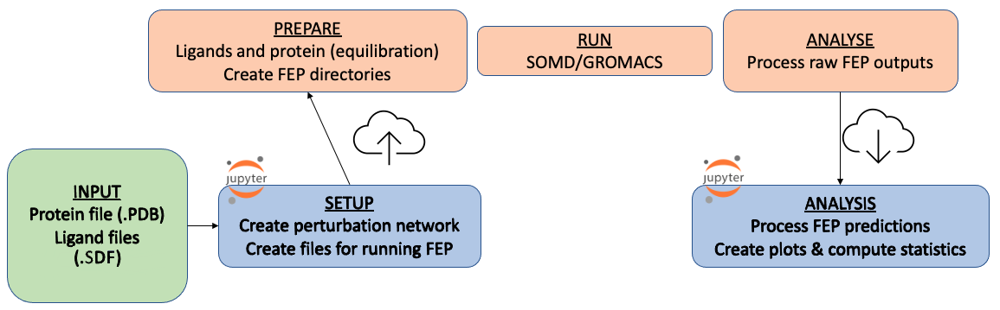
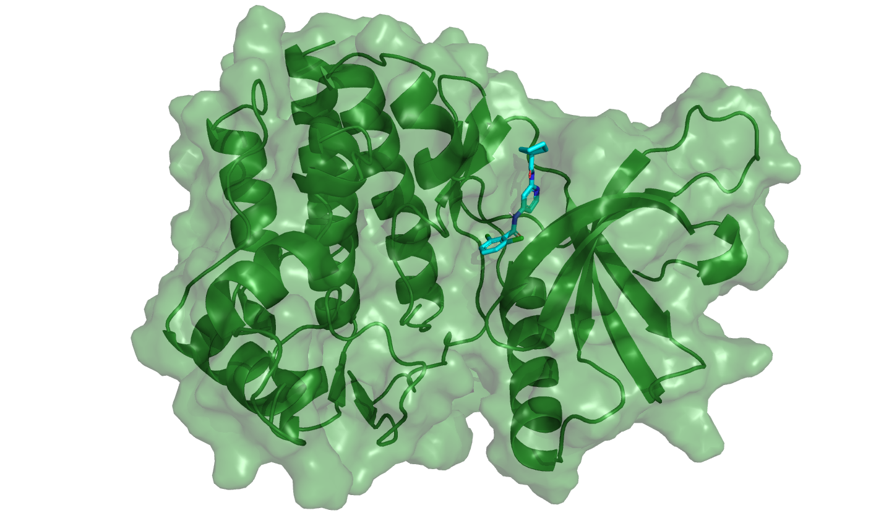

# Relative Binding Free Energy (RBFE) Network Tutorial - Setup

This Jupyter notebook is a tutorial on a setup workflow for RBFE calculations using a Free Energy Perturbation (FEP) network with BioSimSpace.    

This notebook includes core as well as <span style="color:teal">extra</span> options. These extra sections are there to include some more functionality for when the concepts of these tutorials are applied to your own work.  

**<span style="color:teal">Reading Time:</span>**
~ 30 mins

### Maintainers
- [Anna Herz -- @annamherz](https://github.com/annamherz)

See [README.md](https://github.com/michellab/BioSimSpaceTutorials/blob/main/04_fep/README.md) for complete list of authors.

### Prerequisites
 - Basic Python
 - Part 1 of this workshop (An Introduction to setting up alchemical free energy calculations)
    - this should include basic knowledge of the principles behind RBFE

### Learning Objectives
 - Setup an FEP pipeline using BioSimSpace and SOMD or SOMD2.
 - Understanding the scripts for running the pipeline on a cluster.

### Table of Contents
1. [Introduction](#intro)       
    1.1 [The system: TYK2](#tyk2)     
2. [Setup](#setup)   
    2.1 [Choosing the parameters](#parameters)     
    2.2 [Setting up the network](#perts)    
    2.3 [Protein parameterisation](#prot)    
    2.4 [Preparing for the pipeline](#loading)     
3. [Parallelisation](#loading)     

### Further reading for this topic
- [LiveComs Best Practices for Alchemical Free Energy Calculations](https://livecomsjournal.org/index.php/livecoms/article/view/v2i1e18378).

**<span style="color:black">Jupyter Cheat Sheet</span>**
- To run the currently highlighted cell and move focus to the next cell, hold <kbd>&#x21E7; Shift</kbd> and press <kbd>&#x23ce; Enter</kbd>;
- To run the currently highlighted cell and keep focus in the same cell, hold <kbd>&#x21E7; ctrl</kbd> and press <kbd>&#x23ce; Enter</kbd>;
- To get help for a specific function, place the cursor within the function's brackets, hold <kbd>&#x21E7; Shift</kbd>, and press <kbd>&#x21E5; Tab</kbd>;
- You can find the full documentation at [biosimspace.org](https://biosimspace.org).

You can use `!` to access terminal commands: e.g. `! head -n 20 myfilename.dat` will display the first 20 lines of a file. 


### Exercises
Exercises are announced using an alert alert-success box in this way:
<div class="alert alert-success">
<b>Exercise 1.1: Write a function that computes bond lengths:</b>
</div>
and followed by an incomplete cell. All exercises should be numbered. 
Missing parts are indicated by:

```python
#FIXME
```
These are included whilst running through the workshops and also in dedicated sections.   


## Let's get started

Below, we will import the neccessary libraries and also define all the folder locations for our run. This ensures that all of our files are written to where we want them to be.


```python
# import libraries
import BioSimSpace as BSS
import os
import glob
import csv
import numpy as np
import networkx as nx
import matplotlib.pyplot as plt

# define all the folder locations
main_folder = os.getcwd()

# scripts should be located in:
scripts_folder = f"{main_folder}/scripts"
# other folders
input_dir = f"{main_folder}/inputs"
path_to_ligands = f"{main_folder}/inputs/ligands"
path_to_protein = f"{main_folder}/inputs/protein.pdb"
# make a directory for all our output files
if not os.path.exists(f"{main_folder}/output_setup"):
    os.mkdir(f"{main_folder}/output_setup")
```


```python
from get_tutorial import download
download("01")
```

## 1. Introduction
<a id="intro"></a>

Computational chemists can support structure-activity relationship studies in medicinal chemistry by making computer models that can predict binding affinity of ligands to proteins. One of the most popular techniques for this is Free Energy Perturbation (FEP), which relies on simulation alchemical transformations of ligands in a congeneric series, simulating them both in a protein target and in just a waterbox. Relative free energies of binding (ΔΔG in kcal/mol) can then be computed by simply subtracting the ΔG (in protein) and the ΔG (in water). The basics of setting up and running an FEP calculation with BSS have already been covered in the `introduction_to_alchemistry` part of this workshop.

In the previous section of the workshop, we only looked at a singular perturbation. However, typically in FEP the goal is to predict free energies of binding for a collection of ligands (normally 10-20). Although methods exist (such as absolute FEP, which is covered in the `absolute_binding_free_energies` part of this workshop) that can predict these energies directly (i.e. ΔGbind), these are often complicated and computationally expensive, whilst relative binding free energies are more accessible to run and give useful results as we are usually considering a congeneric series of ligands. Because we calculate relative energies, we therefore have to transform the between pairs of ligands in both the free and bound phase (hence the name free energy perturbation). Typically, smaller (i.e. fewer heavy atoms) transformations are more reliable, which means that for a ligand series we want to selectively make combinations of ligands to cover the whole series. In RBFE, we do this using perturbation networks, typically generated by FEP softwares. Although generate these networks can be done by hand, it is typically better to do it programmatically to save time and create better networks (transformation reliability does not depend just on transformation size, but also a series of other unfavourable moiety transformations).   

In this part of the workshop we will focus on how to setup this network for a series of ligands and also write all files necessary to further prepare FEP simulations. The overall pipeline used is shown in the figure below.   



Because preparing ligands and proteins for FEP can already require some heavy computation, this will be the first process that will usually run on a cluster. Then, after running and processing the FEP outputs, the results are usually downloaded back to our local workstation. There, the analysis notebook is used to process FEP predictions and generate plots. As already mentioned, this part of the workshop only focuses on the setup of the pipeline, however how to run these simulations is also explained in more detail at the end of the notebook.


### 1.1. The system: TYK2
<a id="tyk2"></a>

For this tutorial we will be using TYK2, a common benchmarking set in the FEP field, first used by Schrödinger in their [2015 FEP+ paper](https://pubs.acs.org/doi/full/10.1021/ja512751q).




We can also view this protein below:


```python
BSS.Notebook.View(path_to_protein).system()
```

## 2. Setting up the Network
<a id="setup"></a>

### 2.1 Choosing the parameters for the FEP runs
<a id="parameters"></a>

The building blocks provided with BioSimSpace can be used to write interoperable workflow components, or nodes. Typically, a node will perform a single, well-defined, unit of work with clear inputs and outputs. In this simple case here, running the below cell will generate the input nodes that can be used to choose various parameters for the FEP network. More information about Nodes can be found [here](https://biosimspace.org/nodes.html).

The node below includes the forcefields used (ligand, protein, water), the number of lambda windows, and the threshold for the LOMAP score. This threshold will be used to define a perturbation as being either 'regular' or 'difficult', and consequently how many lambda windows will be used. Default parameters are selected for all nodes.


```python
node = BSS.Gateway.Node(
    "A node to create input files for molecular dynamics simulation."
)

node.addInput(
    "Ligand FF",
    BSS.Gateway.String(
        help="Force field to parameterise ligands with.",
        allowed=["GAFF1", "GAFF2"],
        default="GAFF2",
    ),
)

node.addInput(
    "Protein FF",
    BSS.Gateway.String(
        help="Force field to parameterise the protein with.",
        allowed=["FF03", "FF14SB", "FF99", "FF99SB", "FF99SBILDN"],
        default="FF14SB",
    ),
)

node.addInput(
    "Water Model",
    BSS.Gateway.String(
        help="Water model to use.",
        allowed=["SPC", "SPCE", "TIP3P", "TIP4P", "TIP5P"],
        default="TIP3P",
    ),
)

node.addInput(
    "Box Edges",
    BSS.Gateway.String(
        help="Size of water box around molecular system.",
        allowed=[
            "20*angstrom",
            "25*angstrom",
            "30*angstrom",
            "35*angstrom",
            "45*angstrom",
            "5*nm",
            "7*nm",
            "10*nm",
        ],
        default="20*angstrom",
    ),
)

node.addInput(
    "Box Shape",
    BSS.Gateway.String(
        help="Geometric shape of water box.",
        allowed=["cubic", "truncatedOctahedron"],
        default="cubic",
    ),
)

node.addInput(
    "Run Time",
    BSS.Gateway.String(
        help="The sampling time per lambda window.",
        allowed=[
            "10*ps",
            "100*ps",
            "1*ns",
            "2*ns",
            "3*ns",
            "4*ns",
            "5*ns",
            "8*ns",
            "10*ns",
            "12*ns",
            "15*ns",
        ],
        default="2*ns",
    ),
)

# add SOMD2 and AMBER as FEP engine options
fep_engines = [e.upper() for e in BSS.FreeEnergy.engines()]
if "SOMD2" not in fep_engines:
    fep_engines.append("SOMD2")
if "AMBER" not in fep_engines:
    fep_engines.append("AMBER")

node.addInput(
    "FEP Engine",
    BSS.Gateway.String(
        help="Engine to run FEP with.",
        allowed=fep_engines,
        default="SOMD",
    ),
)

node.addInput(
    "LambdaWindows",
    BSS.Gateway.String(
        help="The number of lambda windows for regular transformations.",
        allowed=[
            "3",
            "4",
            "5",
            "6",
            "7",
            "8",
            "9",
            "10",
            "11",
            "12",
            "13",
            "14",
            "15",
            "16",
            "17",
            "18",
            "19",
            "20",
        ],
        default="11",
    ),
)

node.addInput(
    "DiffLambdaWindows",
    BSS.Gateway.String(
        help="The number of lambda windows for difficult transformations.",
        allowed=[
            "4",
            "5",
            "6",
            "7",
            "8",
            "9",
            "10",
            "11",
            "12",
            "13",
            "14",
            "15",
            "16",
            "17",
            "18",
            "19",
            "20",
        ],
        default="17",
    ),
)

node.addInput(
    "LOMAP Threshold",
    BSS.Gateway.String(
        help="The LOMAP score threshold to define difficult transformations.",
        allowed=["0.1", "0.2", "0.3", "0.4", "0.5", "0.6", "0.7", "0.8", "0.9"],
        default="0.4",
    ),
)

node.showControls()
```

After the parameters are chosen, the next step for generating an FEP network is to check the structure of the protein and ligands for which this will be run. 

In general, there are many different ways to generate ligand structures for FEP calculations. It is common to start with an X-ray structure, and edit the bound ligand in some way to create a congeneric series of ligands. Docking the ligands using the bound X-ray ligand as a template is also frequently done. The starting structure of these ligands is important, as a wrong binding pose can have a large impact on the calculated values. Going through the methods to generate these ligand structures is unfortunately outside the scope of this tutorial, so some ligand files are already provided in the 'inputs/ligands' folder. They were generated using [FEGrow](https://github.com/cole-group/FEgrow). This works by generating a congeneric series of ligands for a common core via the addition of R groups, and then optimising these ligands in the context of the receptor binding pocket. 


### 2.2. The FEP Network  
<a id="perts"></a>

As already mentioned, we use perturbation networks when calculating the RBFE for a congeneric ligand series, and the reliability of FEP calculations is typically higher for transformations with fewer heavy atom changes and some other rules (e.g. no ring formations). LOMAP is a package that contains heuristics for this and is able to come up with a network for us; BioSimSpace contains a function `generateNetwork()` that uses LOMAP to come up with the perturbation network that visualises the desired perturbations. Additionally, a LOMAP score is calculated which quantifies the likeliness that the FEP prediction will be reliable (0 means unlikely, 1 means highly likely).   

As the `work_dir` has been set for generating the network, this is the location where all the files from plotting the network are saved. If the image displayed in jupyter notebook is too small, you can look at the network in more detail in `visualise_network/images/network.png`.

 Further reading: [Section 7.1 (perturbation maps, Figure 5), LiveComs Best Practices for Alchemical Free Energy Calculations](https://livecomsjournal.org/index.php/livecoms/article/view/v2i1e18378).


```python
# generate transformation network based on ligands
ligand_files = sorted(glob.glob(f"{path_to_ligands}/*.sdf"))

ligands = []
ligand_names = []

for filepath in ligand_files:
    # append the molecule object to a list.
    ligands.append(BSS.IO.readMolecules(filepath)[0])

    # append the molecule name to another list so that we can use the name of each molecule in our workflow.
    ligand_names.append(filepath.split("/")[-1].replace(".sdf", ""))

transformations, lomap_scores = BSS.Align.generateNetwork(
    ligands,
    plot_network=True,
    names=ligand_names,
    work_dir="output_setup/visualise_network",
)
```

BioSimSpace uses NetworkX which works with node indices for node names. Let's adjust our list of edges to have ligand names instead of ligand indices. We also generate a dictionary that contains all of the network information we need downstream.


```python
pert_network_dict = {}
transformations_named = [
    (ligand_names[transf[0]], ligand_names[transf[1]]) for transf in transformations
]
for score, transf in sorted(zip(lomap_scores, transformations_named)):
    pert_network_dict[transf] = score
    print(transf, score)
```

Unfortunately, even cutting-edge perturbation network generators such as LOMAP require some manual tweaking. In some cases, a ligand will have poor LOMAP scores on its edges and is therefore likely to be unreliable. To increase its reliability we often want to create an additional edge to this ligand, which can be easily done by appending the edge to our list of edges. Additionally, we usually want to avoid any ring breaking/forming transformations.

**<span style="color:skyblue">1.2.1. Exercise: adding perturbations**   

Below, add any other perturbations to complete a cycle. When we add perturbations we want to give them a low LOMAP score so that they run the larger number of windows defined in the protocol at the start. Alternatively, we can also recalculate the LOMAP score for just this single transformation in a similar way to how we calculated the network before, by just defining the network for these two ligands. Give either of these methods a go below:   


```python
pert_network_dict[('A', 'B')] = #FIXME
```

<details><summary {style='color:green;font-weight:bold'}> Click here to see solution to Exercise. </summary>

Arbitrarily, we have picked 0.1 . This is because it is below the LOMAP threshold defined in the protocol at the start.         

```python
pert_network_dict[('ejm48', 'ejm51')] = 0.1
```

Alternatively, if we want to recalculate the LOMAP score for this perturbation, we can also do as follows:         

```python
# if we consider the ligands list, we can use the index of the ligands we want to add an edge for.
# first we need to choose our ligands.
lig_a = "ejm48"
lig_b = "ejm51"

# then, we need to find this index for our chosen edge that we are adding.
lig_a_index = ligand_names.index(lig_a)
lig_b_index = ligand_names.index(lig_b)
# finally, we need to calculate this single lomap score.
single_transformation, single_lomap_score = BSS.Align.generateNetwork([ligands[lig_a_index], ligands[lig_b_index]], names=[ligand_names[lig_a_index], ligand_names[lig_b_index]], plot_network=False)
print(f"LOMAP score for {lig_a} to {lig_b} is {single_lomap_score[0]} .")
pert_network_dict[(lig_a, lig_b)] = single_lomap_score[0]
```

</details>

Another way to manipulate the dictionary is to remove entries (i.e. remove edges from the network). When we look at the edges suggested by LOMAP that have low scores, we see that some are likely to be unreliable in FEP.

<div class="alert alert-success">
<b>Exercise 2.2.2: Removing perturbations</b>
</div>

Below, remove any perturbations with a low LOMAP score. Try and remove more than one perturbation at the same time. However, make sure you don't entirely remove all perturbations for one ligand.


```python
# FIXME
```

<details><summary {style='color:green;font-weight:bold'}> Click here to see solution to Exercise. </summary>

```python
for key in [('ejm42', 'ejm54'), ('ejm31', 'ejm45')]:
    del pert_network_dict[key]

```
Both the lowest scores are with ejm54, however if we remove these ejm54 won't be connected anymore, so we will remove the next lowest perturbation instead.

</details>

Now that we have made these changes to the network, we want to visualise it again. We can do this using NetworkX.


```python
# Generate the graph.
graph = nx.Graph()

# Loop over the nligands and add as nodes to the graph.
for lig in ligand_names:
    graph.add_node(lig, label=lig, labelloc="t")

# Loop over the edges in the dictionary and add to the graph.
for edge in pert_network_dict:
    graph.add_edge(edge[0], edge[1], label=(pert_network_dict[edge]))

# Plot the networkX graph.
pos = nx.kamada_kawai_layout(graph)
plt.figure(figsize=(14, 14), dpi=150)
nx.draw(
    graph,
    pos,
    edge_color="black",
    width=1,
    linewidths=1,
    node_size=1500,
    node_color="skyblue",
    font_size=12,
    labels={node: node for node in graph.nodes()},
)

nx.draw_networkx_edge_labels(
    graph, pos, edge_labels=pert_network_dict, font_color="purple", font_size=10
)

plt.savefig("output_setup/adjusted_network.png", dpi=300)
plt.show()
```

Based on this visualisation, we can see if we have accidentally disconnected a ligand entirely or broken a cycle. As this happened when we removed the 'ejm31 ~ ejm45' and 'ejm42 ~ ejm54', we may decide to add these perturbations back in again and keep our original network, which truthfully was already generated quite well for these TYK2 ligands.  We can see that for the above network, if we have remove the two worst edges in terms of LOMAP score ('ejm42 ~ ejm54' and 'ejm31 ~ ejm54'), we wouldn't actually have any perturbations left with ligand 'ejm54'. At the same time when editing the network, we may decide to add more perturbations for ligands that only have a single transformation, for example 'ejm50'. However, if any other perturbations were a good idea, LOMAP might have already included these in the first place. Overtime as you gain experience, editing the network will become easier.      

Often a low LOMAP score is because cycle formation/removal in a single-topology-style FEP must be from/to a hydrogen, not a carbon atom. This is especially true for aromatic rings, as the hybridisation state of the C changes. To this end, we can introduce a ligand 'intermediate_H' that contains no atoms on the R-group. This makes it easier for the FEP code to perturb to cyclical R-groups. Using this type of network manipulation allows the user to include some more cycles into the network, which is good for statistical performance of FEP predictions. We can still add more edges to this new network as well.

<div class="alert alert-success">
<b>Exercise 2.2.3: Adding an intermediate</b>
</div>

Include the intermediate_H.sdf from the inputs/ligands/intermediate folder in the ligand files used for generating the network.   

Have the scores for ejm54 improved?


```python
ligand_files = # FIXME

ligands = []
ligand_names = []

for filepath in ligand_files:
    # append the molecule object to a list.
    ligands.append(BSS.IO.readMolecules(filepath)[0])
    
    # append the molecule name to another list so that we can use the name of each molecule in our workflow.
    ligand_names.append(filepath.split("/")[-1].replace(".sdf",""))

transformations, lomap_scores = #FIXME

# make the network dict and print the scores as before
# FIXME
```

<details><summary {style='color:green;font-weight:bold'}> Click here to see solution to Exercise. </summary>

```python
#generate transformation network based on ligands
ligand_files_list = glob.glob(f"{path_to_ligands}/*.sdf")
ligand_files_list.append(f"{path_to_ligands}/intermediate/intermediate_H.sdf")
ligand_files = sorted(ligand_files_list)

ligands = []
ligand_names = []

for filepath in ligand_files:
    # append the molecule object to a list.
    ligands.append(BSS.IO.readMolecules(filepath)[0])
    
    # append the molecule name to another list so that we can use the name of each molecule in our workflow.
    ligand_names.append(filepath.split("/")[-1].replace(".sdf",""))

transformations, lomap_scores = BSS.Align.generateNetwork(ligands, plot_network=True, names=ligand_names)

pert_network_dict = {}
transformations_named = [(ligand_names[transf[0]], ligand_names[transf[1]]) for transf in transformations]
for score, transf in sorted(zip(lomap_scores, transformations_named)):
    pert_network_dict[transf] = score
    print(transf, score)

```
The LOMAP scores for ejm54 have improved.

</details>

### 2.3. Protein parameterisation  

Finally, we need to parameterise our protein structure and save the system to the inputs folder. We do this parameterisation locally because it only needs to be done a single time and because it is common for protein input files to need some manual adjustments before they can be parameterised without errors (.pdb files can be messy!).


```python
prot = BSS.IO.readPDB(path_to_protein, pdb4amber=False)[0]
# depending on the picked forcefield and your protein, tleap might fail. Check work_dir to see error logs.
prot_p = BSS.Parameters.parameterise(prot, node.getInput("Protein FF")).getMolecule()
BSS.IO.saveMolecules("inputs/protein", prot_p, ["PRM7", "RST7"])
```

For the scripts used in this pipeline, the parameterised protein is saved in `inputs/prot_water.*`. This protein also includes binding site waters from the crystal structures, which are important to consider. A comprehensive guide to protein parameterisation is outside the scope of this workshop.

### 2.4. Preparing for the FEP pipeline  

Once we have our protein, ligands, and have planned the network, we need to write all the files we need for running the FEP Pipeline.

This includes the following files:
 - ligands.dat , which includes all the ligands that must be prepared
 - network.dat , which includes all the perturbations and the number of lambda windows
 - protocol.dat , which includes the details of the protocol used


```python
# write ligands file.
with open("output_setup/ligands.dat", "w") as ligands_file:
    writer = csv.writer(ligands_file)
    for lig in ligand_names:
        writer.writerow([lig])

# write perts file. Base the lambda schedule on the file generated in the previous cell.
np.set_printoptions(formatter={"float": "{: .4f}".format})

# from protocol, derive the engine we want to use on the cluster.
engine = node.getInput("FEP Engine").upper()

with open("output_setup/network.dat", "w") as network_file:
    writer = csv.writer(network_file, delimiter=" ")

    for pert, lomap_score in pert_network_dict.items():
        # based on the provided (at top of notebook) lambda allocations and LOMAP threshold, decide allocation.
        if lomap_score == None or lomap_score < float(node.getInput("LOMAP Threshold")):
            num_lambda = node.getInput("DiffLambdaWindows")
        else:
            num_lambda = node.getInput("LambdaWindows")

        # given the number of allocated lambda windows, generate an array for parsing downstream.
        lam_array_np = np.around(np.linspace(0, 1, int(num_lambda)), decimals=5)

        # make the array into a format readable by bash.
        lam_array = (
            str(lam_array_np)
            .replace("[ ", "")
            .replace("]", "")
            .replace("  ", ",")
            .replace("\n", "")
        )

        # write out both directions for this perturbation.
        writer.writerow([pert[0], pert[1], len(lam_array_np), lam_array, engine])
        writer.writerow([pert[1], pert[0], len(lam_array_np), lam_array, engine])

# create protocol.
protocol = [
    f"ligand forcefield = {node.getInput('Ligand FF')}",
    f"protein forcefield = {node.getInput('Protein FF')}",
    f"solvent = {node.getInput('Water Model')}",
    f"box edges = {node.getInput('Box Edges')}",
    f"box type = {node.getInput('Box Shape')}",
    f"protocol = default",
    f"sampling = {node.getInput('Run Time')}",
    f"engine = {node.getInput('FEP Engine').upper()}",
]

# write protocol to file.
with open("output_setup/protocol.dat", "w") as protocol_file:
    writer = csv.writer(protocol_file)

    for prot_line in protocol:
        writer.writerow([prot_line])
```

We can look at the contents of these files below:


```python
! cat output_setup/ligands.dat
print(" ")
! cat output_setup/network.dat
print(" ")
! cat output_setup/protocol.dat
```

## 3. Parallelisation - Running the MD simulations

Once all the files are written, the folder can be copied to a computing cluster so that the simulations can be parallelised. A simple example script for this for a slurm cluster is included in the scripts directory. The scripts are mainly for reference, and will need adjustment in terms of sourcing the various codes / some processes before they can be run.

Th run_all_slurm.sh calls the following scripts in order:

 - Ligand preparation (ligprep.py, run_ligprep_slurm.sh) - The ligand and protein are paramaterised, combined, and solvated. Equilibration is carried out.

 - FEP preparation (fepprep.py, run_fepprep_slurm.sh) - For the perturbation, the ligands are mapped according to their maximum common substructure, and a perturbable system is created. The folders for the FEP run for SOMD or GROMACS are written.

 - Running the production windows (run_production_slurm.sh) - As each lambda window can be run independantly of other lambda windows, this is where most of the parallelisation takes place. Each window is submitted as part of a slurm array job.

 - Analysis (analysis.py, run_analysis_slurm.sh) - A simple analysis, outputting the data in a format suitable for the analysis tutorial.

Older scripts, including one for an LSF cluster, are in the `04_fep/fep_archiv` folder.

As these would take too long to run and analyse in the span of a workshop, sample outputs are available in the analysis folder for the next part of the tutorial. Example outputs for the exercises in this tutorial are available in the `example_output/example_output_setup` folder.

<div class="alert alert-info"><b>Note:</b> Checkout the next tutorial</div>

This will cover how to analyse the results for an RBFE Network. You can get started with the setup notebook by following this link:
[02_analysis_rbfe.ipynb](02_analysis_rbfe.ipynb)
