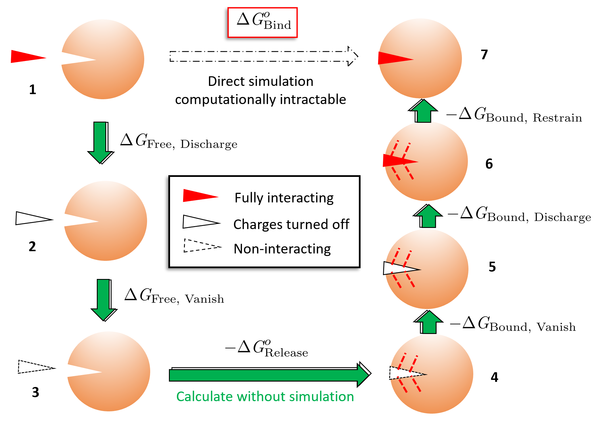
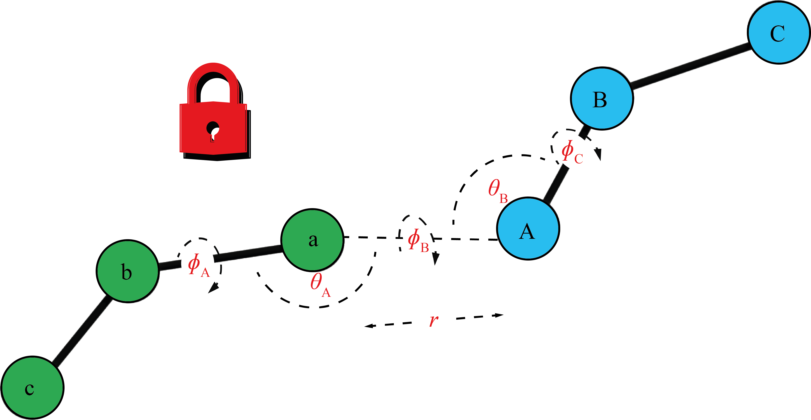
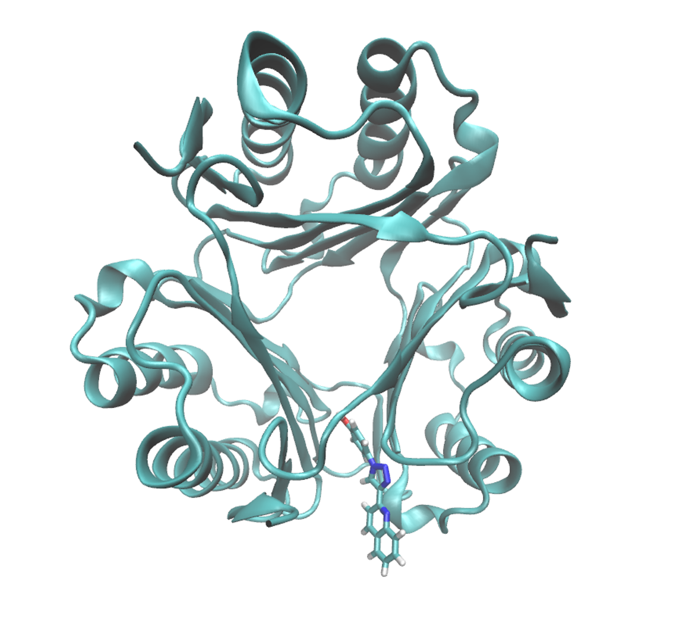
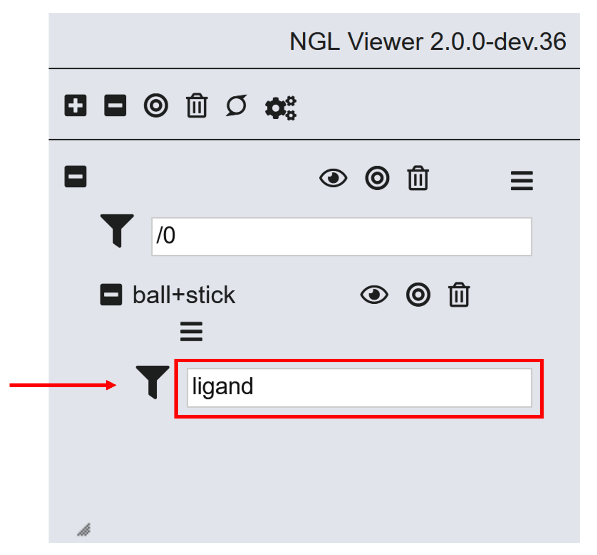
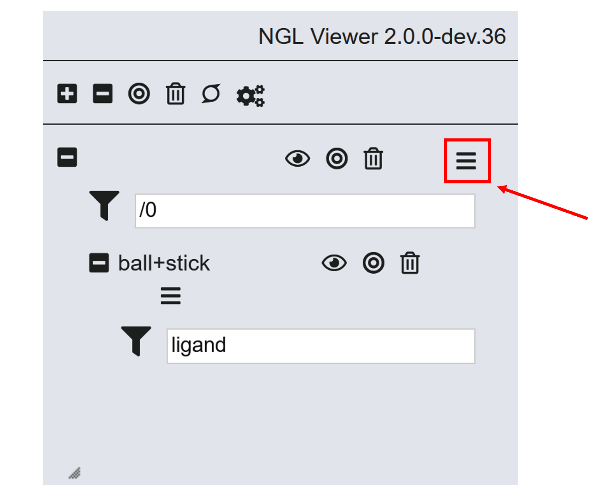
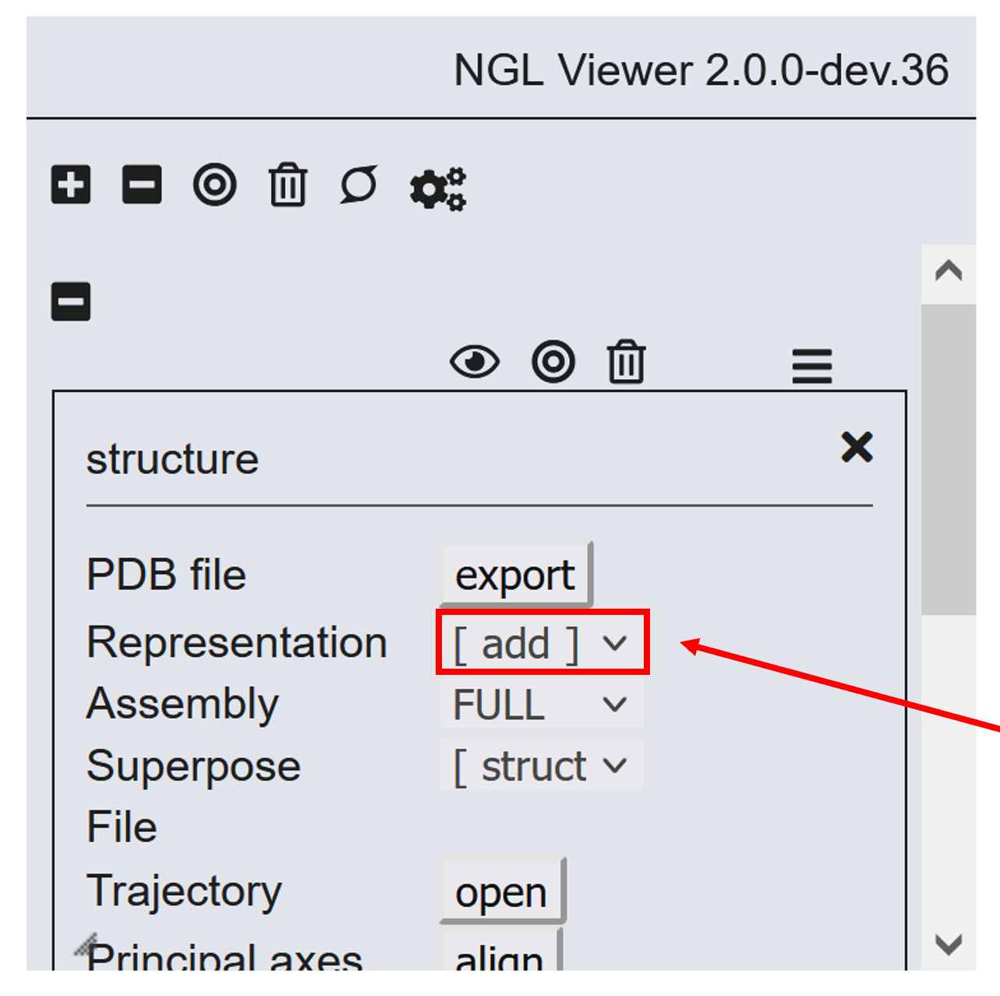
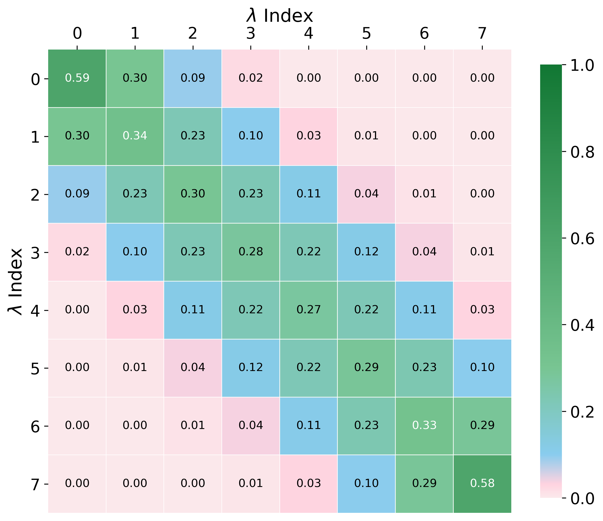

# Absolute Binding Free Energies and Experimental Features in BioSimSpace: Setup

This is the first of two jupyter notebooks on Absolute Binding Free Energy (ABFE) calculations in BioSimSpace. This notebook describes how the functionality of BioSimSpace may be extended using the *sandpit*, and how to set up an absolute binding free energy calculation using the functionality present in the Exscientia sandpit. The second notebook, "analyse_abfe.ipynb" will discuss the analysis of absolute binding free energy calculations.

### Maintainers
 - Finlay Clark -- finlay.clark@ed.ac.uk (@fjclark)

### Prerequisites

 - Completion of the FEP `01_intro_to_alchemy` tutorial.
    
### Learning Objectives

 - Understand how the functionality of BioSimSpace can be extended to include experimental features using the *sandpit*
 - Setup an absolute binding free energy calculation using the functionality present with the Exscientia sandpit
 
### TOC

 - [1. Experimental Features in BioSimSpace](#exp_feat)    
 - [2. Alchemical Absolute Binding Free Energies](#abfe)   
    - [2.1 Theory: A Brief Overview](#theory)     
    - [2.2 Implementation in BioSimSpace](#implementation)    
    - [2.3 Loading the System](#loading)    
    - [2.4 Marking the Ligand to be Decoupled](#decouple)    
    - [2.5 Selecting the Restraints](#restraints)    
    - [2.6 Setting Up the Bound Leg Simulations](#bound)    
    - [2.7 Running the ABFE Calculations](#running)      

### Further reading for this topic
- [LiveComs Best Practices for Alchemical Free Energy Calculations](https://livecomsjournal.org/index.php/livecoms/article/view/v2i1e18378).

**<span style="color:black">Jupyter Cheat Sheet</span>**
- To run the currently highlighted cell and move focus to the next cell, hold <kbd>&#x21E7; Shift</kbd> and press <kbd>&#x23ce; Enter</kbd>;
- To run the currently highlighted cell and keep focus in the same cell, hold <kbd>&#x21E7; Ctrl</kbd> and press <kbd>&#x23ce; Enter</kbd>;
- To get help for a specific function, place the cursor within the function's brackets, hold <kbd>&#x21E7; Shift</kbd>, and press <kbd>&#x21E5; Tab</kbd>;

### Link to documentation:
You can find the full documentation on [the OpenBioSim website](https://biosimspace.openbiosim.org/).

## 1 Experimental Features in BioSimSpace
<a id="exp_feat"></a>

In order to make experimental features available alongside the current development version, BioSimSpace provides a *sandpit* area. This can be found at `BioSimSpace.Sandpit`. A sandpit contains a complete copy of the standard BioSimSpace code along with experimental modifications and added functionality. The idea is that new features can be quickly made available while we work on ways to merge them into the main code.

A particular sandpit, S, can be imported as `import BioSimSpace.Sandpit.S as BSS`. Currently there is only one sandpit, belonging to Exscientia. We will be using this today:


```python
import BioSimSpace.Sandpit.Exscientia as BSS
import numpy as np
import pandas as pd
```

As an example of an experimental feature, we will show how to use the alchemical absolute binding free energy functionality present in `BioSimSpace.Sandpit.Exscientia`, which we are working on in collaboration with Exscientia. This will eventually be merged into the main code.

## 2. Alchemical Absolute Binding Free Energies
<a id="abfe"></a>
### 2.1 Theory: A Brief Overview
<a id="theory"></a>

While relative binding free energy (RBFE) calculations can be very useful in drug discovery, several important problems lie outside the scope of standard RBFE calculations:

- Calculating the relative binding free energies of structurally dissimilar ligands to a common target.
- Calculating relative binding free energies of the same ligand to the same protein with different binding poses. This could be used to rigorously "score" different poses.
- Calculating the relative binding free energies of the same ligand to different targets. This could be useful to optimise selectivity or promiscuity. 

Alchemical absolute binding free energy (ABFE) calculations escape these limitations by following a more general thermodynamic cycle in which the ligand’s intermolecular interactions are completely turned off:



We will refer to the left side of the cycle (where the ligand is in solution) as the "free leg", and the right side of the cycle (where the ligand is bound) as the "bound leg". The simulations represented by individual arrows will be called "stages".

The absolute binding free energy can be obtained by adding up the terms round our free energy cycle, not forgetting any [symmetry corrections](https://aip.scitation.org/doi/full/10.1063/5.0046853) (for example if there is more than 1 symmetrical binding site per protein):

\begin{align*}
    \Delta\textit{G}^o_{\textrm{Bind}}
    =&\Delta\textit{G}_{\textrm{Free, Discharge}}
    +\Delta\textit{G}_{\textrm{Free, Vanish}}
    -\Delta\textit{G}_{\textrm{Release}}^o
    -\Delta\textit{G}_{\textrm{Bound, Vanish}}\\
    &-\Delta\textit{G}_{\textrm{Bound, Discharge}}
    -\Delta\textit{G}_{\textrm{Bound, Restrain}}
    +\Delta\textit{G}_{\textrm{Sym. Corr.}}\\
\end{align*}

The price paid for greater generality is that these calculations are generally harder to converge, as a result of the larger "perturbation" made (complete removal of the ligand).

In some ways ABFE calculations are simpler than RBFE calculations, in that we do not need to align and merge two ligands. However, ABFE calculations require receptor-ligand restraints (shown by the red dotted lines above) to prevent sampling issues. To obtain converged free energies of binding without restraints, we would have to be sure that the ligand was sampling outside the binding site as soon as the unbound state became comparable in free energy to the bound state, and that we were correctly estimating the ratios of the sizes of the simulation box to the binding site; in practice, this is not generally feasible.

There are several varieties of receptor-ligand restraints, including [distance-to-bound configuration (DBC) restraints](https://pubs.acs.org/doi/full/10.1021/acs.jctc.8b00447), [restraints on coarse variables derived by finding the optimal rotation which minimises the complex's RMSD with respect to a reference structure](https://pubs.acs.org/doi/full/10.1021/acs.jctc.7b00791), and [multiple distance restraints](https://pubs.acs.org/doi/10.1021/acs.jctc.3c00139).

Here, we will use the set of receptor-ligand restraints originally proposed by [Boresch et al.](https://pubs.acs.org/doi/full/10.1021/jp0217839), because they are simple to implement, very widely used, and the only restraints currently supported by BioSimSpace. These restrain all 6 relative external degrees of freedom (three translational and three rotational) of the ligand with respect to the receptor. This is done by imposing harmonic restraints on one distance, two angles, and three dihedral angles defined by three anchor points in the protein (P1-3) and three in the ligand (L1-3):



It is important to correct for the presence of restraints. Intuitively, we can see that the volume accessible to the non-interacting ligand in state 3 will be different to that accessible in state 4 with the restraints applied, so there must be an entropy change. The standard free energy of releasing the restraint is calculated according to:

\begin{equation*}
\Delta\textit{G}^o_{\text{Release}} = -\textit{k}_\textit{B}\textit{T}\ln{\frac{V^o}{V_L}\frac{8\pi^2}{\xi_L}}
\end{equation*}

Where $V_L$ and $\xi_L$ are the effective translational and rotational volumes for the restrained non-interacting ligand, and $V^o$ is the standard state volume (1660 &#x212B;$^3$, which corresponds to 1 mol l $^{-1}$).  The use of the standard state volume makes the correction independent of the size of the simulation box. $8\pi^2$ is the rotational "volume" of an unrestrained ligand. Imagine pointing the z axis of a 3D Cartesian coordinate system anywhere on the surface of a sphere - this gives a contribution of $4\pi$ steradians. For each orientation of the z axis, the x and y axes can be rotated through $2\pi$ radians, giving a total of $2\pi4\pi = 8\pi^2$.

### 2.2 Implementation in BioSimSpace
<a id="implementation"></a>

Currently, absolute binding free energies are only implemented for GROMACS and SOMD in BioSimSpace. 

### 2.3 Loading the System
<a id="loading"></a>

We will assume that you already have an equilibrated system ready for simulation. For details on how to do this in BioSimSpace, see the introductory tutorials. Here, we'll be using the complex of [human macrophage migration inhibitory factor (MIF) and the ligand MIF-180](https://pubs.acs.org/doi/full/10.1021/acs.jpcb.9b07588):



The equilibrated input files are available in `input/complex`.

First let's download the inputs


```python
from get_tutorial import download
download("01")
```


```python
# load the system
system = BSS.IO.readMolecules(
    ["input/complex/mif_mif180.prm7", "input/complex/mif_mif180.rst7"]
)
```

The ligand, MIF180, is the first molecule in the system:


```python
system[0]
```

We can check the name using the `getResidues` method of the molecule:


```python
system[0].getResidues()
```

### 2.4 Marking the Ligand to be Decoupled
<a id="decouple"></a>

We have to tell BioSimSpace the molecule for which we want to remove the intermolecular interactions, or to "decouple". The function for doing this is stored in the same place as the tools needed to align and merge molecules for RBFE calulations, in `BSS.Align`.

It's important to save the updated status of the molecule in the system object using the `updateMolecule` method.


```python
lig = BSS.Align.decouple(system[0])
system.updateMolecule(0, lig)
```

We can check that our system contains a molecule marked for decoupling:


```python
system.nDecoupledMolecules()
```

And we can extract the decoupled molecule, if required:


```python
decoupled_mol = system.getDecoupledMolecules()
print(decoupled_mol)
```

We are using "decouple" in the sense of [Gilson et al.](https://www.sciencedirect.com/science/article/pii/S0006349597787563) to mean removal of at least the intermolecular interactions (and optionally intramolecular non-bonded interactions) of the ligand in the presence of restraints, but be aware that it can have a different meaning (see reference 61 of [Mobley, Chodera, and Dill](https://aip.scitation.org/doi/full/10.1063/1.2221683)).

### 2.5 Selecting the Restraints
<a id="restraints"></a>

The performance of ABFE calculations can be highly dependent on the restraints used. Considering the simulations connecting states 6 and 7 (see cycle above), we would like the restraints to be weak, so that the unrestrained complex is minimally perturbed and convergence is quickly achieved. However, the fastest convergence of the simulations connecting stages 4, 5, and 6 will likely be achieved by using relatively strong restraints to restrict the configurational volume which must be sampled as much as possible. We can strike a compromise between these opposing requirements by selecting the restraints to mimic native protein-ligand interactions as closely as possible, which allows us to find the strongest possible restraints which minimally perturb the unrestrained fully interacting state.

In addition, Boresch restraints have instabilities which are most commonly encountered when any of the contiguous anchor points are close to collinear (for example P2, P1, and L1 in the Boresch diagram). This results in large fluctuations in the dihedral angles and the application of large forces through the dihedral restraints - this can "blow-up" the molecular dynamics integrator, causing the simulation to crash. So, we must be careful to avoid such poor selections when choosing our restraint. 

BioSimSpace allows you to select Boresch restraints in an automated way, by running an unrestrained simulation of the fully interacting complex to allow the dynamics of the ligand with respect to the protein to be analysed. This is done using the `BSS.FreeEnergy.RestraintSearch` class, which is used to run and analyse the simulation to generate the restraints:

```Python
# Create a protocol for the unrestrained simulation
protocol = BSS.Protocol.Production(runtime=5*BSS.Units.Time.nanosecond)
# Create a RestraintSearch object to run and analyse the simulation
restraint_search = BSS.FreeEnergy.RestraintSearch(system, protocol=protocol, engine='gromacs', work_dir='output/restraint_search')
# Run the simulation
restraint_search.start()
# Wait for the simulation to finish (block=True), then analyse the simulation to find the restraints
restraint = restraint_search.analyse(method='BSS', block=True)
```

However, given the computational cost of a 5 ns simulation, we've already run a quick simulation (0.5 ns) for you to analyse - see output/restraint_search. We will now use RestraintSearch to analyse the pre-generated trajectory:


```python
download("02")
```


```python
# Load the trajectory
traj = BSS.Trajectory.Trajectory(
    trajectory="output/restraint_search/gromacs.xtc",
    topology="input/complex/mif_mif180.prm7",
)

# Search for the optimal Boresch restraints
restraint = BSS.FreeEnergy.RestraintSearch.analyse(
    work_dir = "output/restraint_search",
    system = system,
    traj = traj,
    temperature = 298 * BSS.Units.Temperature.kelvin,
    method="BSS",
    restraint_type = "Boresch",
)
```


```python
restraint
```

Here we use the inbuilt BioSimSpace method to perform the restraint search. 

In this algorithm candidate sets of Boresch restraints are generated and the fluctuations of the associated Boresch degrees of freedom are tracked over the unrestrained simulation. The optimum Boresch degrees of freedom are then selected based on minimum configurational volume accessible to the restrained non-interacting ligand, and the force constants are calculated to mimic the native protein-ligand interactions. Likely stability of the restraints is assessed by ensuring that the restraints impose an energy penalty of at least 10 $k_\mathrm{B}T$ for unstable anchor point geometries. See S6 and S7 [here](https://ndownloader.figstatic.com/files/41107959) for a discussion of some of these points.

As well as Boresch restraints, BioSimSpace supports using [multiple distance restraints](https://pubs.acs.org/doi/full/10.1021/acs.jctc.3c00139) for ABFE calculations with both SOMD and GROMACS - simply set `restraint_type = "multiple_distance"` in `RestraintSearch.analyse`. Note that you'll have to specify `method = "numerical` when runnning `restraint.getCorrection` and you'll need to run an extra calculation stage to release all but one restraint after decoupling the ligand. Examples of how to set up ABFE calculations for both Boresch and multiple distance restraints are given at the end of this notebook for both GROMACS and SOMD.

It's always a good idea to check the distributions of the restrained degrees of freedom over the course of the simulations and their values against simulation time. Check the output directory to see the plots.
 
<div class="alert alert-success">
<b>Exercise 1: Issues with Restraint Selection</b>
</div>

What issues could arise during the restraint selection stage? How might the plots mentioned above help to diagnose some of these issues?

 ```Python
 #FIXME: Answer the above question
 ```

<details><summary {style='color:green;font-weight:bold'}> Click here to see solution to Exercise. </summary>

One possible issue is that there could be several slowly-interconverting binding poses. This may show up as a multimodal distribution in the histograms, with infrequent transitions between poses evident from the plots of the values of the Boresch degrees of freedom against time. This would represent a sampling issue, as equilibrium sampling of the binding poses would be required to obtain correct free energies, at least while turning on the restraints. This should be dealt with using either enhanced sampling of the two poses, or by performing separate binding free energy calculations for each pose and combining the answers, as described in the analysis notebook.      

</details>

 The RestraintSearch has returned a restraint object:


```python
type(restraint)
```

We can obtain $\Delta\textit{G}_{\textrm{Release}}^o$ by using the `getCorrection` method:


```python
restraint.getCorrection()
```

And we can check the anchor points, force constants, and equilibrium values selected by printing out the restraint in SOMD format:


```python
restraint.toString(engine="Somd")
```

Note that the SOMD restraint string uses atom indices and units of &#x212B;, $\mathrm{rad}$, and $\mathrm{kcal}$ $\mathrm{mol^{-1}}$. Also, the force constants, $k$, are defined as $E = k(x - x_0)^2$. This means that the force constants are halved in order to be consistent with the definition $E = \frac{1}{2} k(x - x_0)^2$ used by BioSimSpace.

<div class="alert alert-success">
<b>Exercise 2: Visualise the Anchor Points</b>
</div>

Let's view the anchor atoms to make sure they're sensible. [This page](https://nglviewer.org/ngl/api/manual/usage/selection-language.html) on the NGLViewer selection language may be helpful. To view the anchor atoms:

- Run the cell below
- For the default ball and stick representation, select only the ligand atoms



- Click on the menu



- Create a new "cartoon" representation. This will only display the protein



- To visualise the anchor points, add a "spacefill" representation. Then input the selection "@idx1,idx2,id3,..." where the idxs are the indices of the anchor points


```python
view = BSS.Notebook.View(system)
view.molecules([0, 1, 2, 3])  # View the ligand and all three protein chains
# FIXME: Follow the instructions above to view the anchor points
```

Do the selected anchor points appear reasonable? Why have they been selected?

<div class="alert alert-success">
<b>Exercise 3: Modify The Restraint Search</b>
</div>

Repeat the restraints derivation but modify the behaviour of BSS.FreeEnergy.RestraintSearch.analyse so that ligand anchor atoms in the triazole ring are selected. You can obtain the atom names by hovering the cursor in NGLView. Multiple atoms can be selected by name in the [MDAnalysis atom selection language](https://userguide.mdanalysis.org/stable/selections.html) as "name atname1 atname2 atname3..."


```python
# Check the docstring
?BSS.FreeEnergy.RestraintSearch.analyse
```


```python
# FIXME: Modify the restraint search so that only anchor points in the triazole ring of the ligand are selected
```

<details><summary {style='color:green;font-weight:bold'}> Click here to see solution to Exercise. </summary>

```python
traj = BSS.Trajectory.Trajectory(trajectory="output/restraint_search/gromacs.xtc",
                                 topology="input/complex/mif_mif180.prm7")
                                 
restraint = BSS.FreeEnergy.RestraintSearch.analyse("output/restraint_search", system, traj, 
                                                    298 * BSS.Units.Temperature.kelvin, method='BSS',
                                                    append_to_ligand_selection="name CAR CAL NAV NAM NAN")

```
    
Check the indices of the anchor points as follows:

```python
restraint.toString(engine="SOMD")
```
</details>


```python
# FIXME: Visualise the new anchor atoms using NGLView
```

### 2.6 Setting Up The Bound Leg Simulations
<a id="bound"></a>

Now that we have our restraints, we can set up the bound leg simulations. These are managed by `BSS.FreeEnergy.AlchemicalFreeEnergy`. This class handles both relative and absolute binding free energy calculations (and contains all the functionality present in `BSS.FreeEnergy.Relative` in the main version of the code). We will need to run three bound leg simulations to account for turning on the restraints, discharging (Coulombic interactions), and vanishing (Lennard-Jones interactions) the ligand. Note that the perturbation types required for these stages are "restraint", "discharge_soft", and "vanish_soft", respectively.

One important parameter is the number of $\mathrm{\lambda}$ windows selected, as their number and spacing will affect the reliability of the free energy estimates in an estimator-dependent way. We plan to use the [multistate Bennett acceptance ratio (MBAR)](https://aip.scitation.org/doi/full/10.1063/1.2978177), which requires sufficient phase space overlap between adjacent $\mathrm{\lambda}$ windows - we must have a high enough probability of observing the samples we generate at one value of $\mathrm{\lambda}$ at the neighbouring values of $\mathrm{\lambda}$. Unfortunately, the optimum set of $\mathrm{\lambda}$ values is system-specific and is not easily predicted before running any simulations. For this system, we ran a test simulation with a set of lambda windows taken from a previous study and added or removed windows to ensure sufficient overlap without having too many windows, which would be a waste of simulation time. 

An example overlap matrix (discharge stage of the bound leg) for the final set of $\mathrm{\lambda}$ windows is shown below:



The first off-diagonal terms are sufficiently large (much greater than the [empirical cut-off of 0.03](https://link.springer.com/article/10.1007/s10822-015-9840-9)), indicating good overlap and giving us some confidence that the MBAR estimate will be reliable.

Note that initially, the output directory does not contain a "restrain" directory:


```python
! ls output
```


```python
# Set up restraining stage
lam_vals_restrain = [0.000, 0.250, 0.500, 1.000]
restrain_protocol = BSS.Protocol.FreeEnergy(
    runtime=6 * BSS.Units.Time.nanosecond,
    lam_vals=lam_vals_restrain,
    perturbation_type="restraint",
)
restrain_fe_calc = BSS.FreeEnergy.AlchemicalFreeEnergy(
    restraint.system,
    restrain_protocol,
    engine="somd",
    restraint=restraint,
    work_dir="output/restrain",
)

```

BioSimSpace has set up the required `work_dir`s for the restrain stage, and all the files needed to run the simulation should have been set up. Have a look!


```python
! ls output
```

We could run the restrain stage simulations using:

```Python
restrain_fe_calc.run()
```
However, these would take hours to run, so we'll avoid starting them now.

Setting up calculations is quite memory-intensive. As we have limited resources on the server, we'll avoid setting up any more stages. Below are some examples of how to set up a the remaining stages for the bound leg (discharging and vanishing stages), how to set up the free leg, and how to set up using GROMACS instead of SOMD.

<div class="alert alert-success">
<b>Example: Setting up the bound leg discharge and vanish stages with a 1 fs timestep</b>
</div>

```Python
# Set up discharge stage
lam_vals_discharge = [0.000, 0.143, 0.286, 0.429, 0.571, 0.714, 0.857, 1.000]

discharge_protocol = BSS.Protocol.FreeEnergy(
    runtime=6 * BSS.Units.Time.nanosecond,
    timestep=1*BSS.Units.Time.femtosecond, 
    lam_vals=lam_vals_discharge,
    perturbation_type="discharge_soft",
)
discharge_fe_calc = BSS.FreeEnergy.AlchemicalFreeEnergy(
    restraint.system,
    discharge_protocol,
    engine="somd",
    restraint=restraint,
    work_dir="output/discharge",
)

# Set up vanish stage
lam_vals_vanish = [0.000, 0.025, 0.050, 0.075, 0.100, 0.125, 0.150, 0.175, 0.200, # We need a lot of these to
                   0.225, 0.250, 0.275, 0.300, 0.325, 0.350, 0.375, 0.400, 0.425, # ensure sufficient overlap
                   0.450, 0.475, 0.500, 0.525, 0.550, 0.575, 0.600, 0.625, 0.650, # between windows!
                   0.675, 0.700, 0.725, 0.750, 0.800, 0.850, 0.900, 0.950, 1.000] 

vanish_protocol = BSS.Protocol.FreeEnergy(runtime=6*BSS.Units.Time.nanosecond, 
                                          timestep=1*BSS.Units.Time.femtosecond, 
                                          lam_vals=lam_vals_vanish, 
                                          perturbation_type="vanish_soft")

vanish_fe_calc = BSS.FreeEnergy.AlchemicalFreeEnergy(restraint.system, 
                                                     vanish_protocol, 
                                                     engine='somd', 
                                                     restraint=restraint, 
                                                     work_dir='output/vanish')
```

<div class="alert alert-success">
<b>Example: Setting up the free leg</b>
</div>

```Python
lam_vals_discharge_free = [0.000, 0.143, 0.286, 0.429, 0.571, 0.714, 0.857, 1.000]

free_discharge_protocol = BSS.Protocol.FreeEnergy(runtime=6*BSS.Units.Time.nanosecond, 
                                                  lam_vals=lam_vals_discharge_free, 
                                                  perturbation_type="discharge_soft")

# Assuming that you've already prepared "free_system", which is just the ligand in a box of water, 
# and marked the ligand to be decoupled, as shown earlier in this notebook. To set up a ligand
# in a water box, see the introductory tutorials.
free_discharge_fe_calc = BSS.FreeEnergy.AlchemicalFreeEnergy(free_system,
                                                             free_discharge_protocol,
                                                             engine='somd',
                                                             restraint=None, # Restraints not needed.
                                                             work_dir='output/free_discharge')

lam_vals_vanish_free = [0.000, 0.028, 0.056, 0.111, 0.167, 0.222, 0.278, 0.333, 0.389, 0.444, 
                        0.500, 0.556, 0.611, 0.667, 0.722, 0.778, 0.889, 1.000]

free_vanish_protocol = BSS.Protocol.FreeEnergy(runtime=6*BSS.Units.Time.nanosecond, 
                                               lam_vals=lam_vals_vanish_free,
                                               perturbation_type="vanish_soft")

# As noted above, we assumed that you've already prepared "free_system" (the ligand in a box
# of water) and marked the ligand to be decoupled.
free_vanish_fe_calc = BSS.FreeEnergy.AlchemicalFreeEnergy(free_system,
                                                          free_vanish_protocol,
                                                          engine='somd', 
                                                          restraint=None, # Restraints not needed.
                                                          work_dir='output/free_vanish')
```

<div class="alert alert-success">
<b>Example: Setting up the bound leg with GROMACS</b>
</div>

Note that the perturbation type must be "full" (restraining, discharging and vanishing carried out in a single simulation) and the lambda values should be supplied as a pandas data frame (because GROMACS allows different lambda values to be specified simultaneously for each stage):

```Python
lam_vals=pd.DataFrame(data={'bonded': [0.0, ... 1.0],
                            'coul': [0.0, ... 1.0],
                            'vdw':  [0.0, ... 1.0]})
```
Because of this, the initial value of lambda must be set as a pandas series:
```Python
lam=pd.Series(data={'bonded': 0.0, 'coul': 0.0, 'vdw': 0.0})
```
Remember to supply the above information when specifying the protocol.

An example of a reasonable $\mathrm{\lambda}$ schedule is:
```Python
gromacs_lam_vals=pd.DataFrame(
                data={'bonded': [0.0, 0.01, 0.025, 0.05, 0.075, 0.1, 0.2, 
                                 0.35, 0.5, 0.75, 1.0, 1.0, 1.0, 1.0, 1.0,
                                 1.0, 1.0, 1.0, 1.0, 1.0, 1.0, 1.0, 1.0, 
                                 1.0, 1.0, 1.0, 1.0, 1.0, 1.0, 1.0, 1.0, 1.0],
                      'coul': [0.0, 0.0, 0.0, 0.0, 0.0, 0.0, 0.0, 0.0, 0.0,
                               0.0, 0.0, 0.16, 0.33, 0.5, 0.67, 0.83, 1.0,
                               1.0, 1.0, 1.0, 1.0, 1.0, 1.0, 1.0, 1.0, 1.0,
                               1.0, 1.0, 1.0, 1.0, 1.0, 1.0],
                      'vdw':  [0.0, 0.0, 0.0, 0.0, 0.0, 0.0, 0.0, 0.0, 0.0,
                               0.0, 0.0, 0.0, 0.0, 0.0, 0.0, 0.0, 0.0, 0.1, 
                               0.2, 0.3, 0.4, 0.5, 0.55, 0.6, 0.65, 0.7, 0.75,
                               0.8, 0.85, 0.9, 0.95, 1.0]}
                         )
```
The code to set up the bound leg is then:
```Python
initial_lam=pd.Series(data={'bonded': 0.0, 'coul': 0.0, 'vdw': 0.0})
                         
gromacs_protocol = BSS.Protocol.FreeEnergy(runtime=6*BSS.Units.Time.nanosecond, 
                                           lam=initial_lam,
                                           lam_vals=gromacs_lam_vals, 
                                           perturbation_type="full")

gromacs_fe_calc = BSS.FreeEnergy.AlchemicalFreeEnergy(restraint.system, 
                                                      gromacs_protocol, 
                                                      engine='gromacs', restraint=restraint, 
                                                      work_dir='output/gromacs')
```

<div class="alert alert-success">
<b>Example: Setting up the bound leg with GROMACS using multiple distance restraints</b>
</div>

The two main differences when using multiple distance restraints compared to Boresch restraints with GROMACS are a) the restraint strenght is scaled with `restraint` lambda, rather than `bonded` lambda, and b) we need to run a seperate "release_restraint" stage, where we calculate the free energy change for turning off all but one of the distance restraints. This is because we cannot calculate the entropic correction for releasing multiple distance restraints without simulation, but we can easily calculate this for a single distance restraint. It should also be noted that the "release_restraint" stage is effectively run in the opposite direction to the other states (lambda 0 - > 1 turns on the restraints, but we want the free energy of turning off the restraints), so the sign of the free energy change need to be reversed before being added to the "full" stage free energy change. An example of how to set up these stages is given below:

```Python

# First, set up the "full" stage, as above. During this stage,
# we turn on the restraints with the ligand interacting, discharge
# the ligand, and vanish the ligand.
initial_lam_full=pd.Series(data={'restraint': 0.0, 'coul': 0.0, 'vdw': 0.0})
full_stage_lam_vals=pd.DataFrame(
                data={'restraint': [0.0, 0.01, 0.025, 0.05, 0.075, 0.1, 0.2, 
                                    0.35, 0.5, 0.75, 1.0, 1.0, 1.0, 1.0, 1.0,
                                    1.0, 1.0, 1.0, 1.0, 1.0, 1.0, 1.0, 1.0, 
                                    1.0, 1.0, 1.0, 1.0, 1.0, 1.0, 1.0, 1.0, 1.0],
                      'coul': [0.0, 0.0, 0.0, 0.0, 0.0, 0.0, 0.0, 0.0, 0.0,
                               0.0, 0.0, 0.16, 0.33, 0.5, 0.67, 0.83, 1.0,
                               1.0, 1.0, 1.0, 1.0, 1.0, 1.0, 1.0, 1.0, 1.0,
                               1.0, 1.0, 1.0, 1.0, 1.0, 1.0],
                      'vdw':  [0.0, 0.0, 0.0, 0.0, 0.0, 0.0, 0.0, 0.0, 0.0,
                               0.0, 0.0, 0.0, 0.0, 0.0, 0.0, 0.0, 0.0, 0.1, 
                               0.2, 0.3, 0.4, 0.5, 0.55, 0.6, 0.65, 0.7, 0.75,
                               0.8, 0.85, 0.9, 0.95, 1.0]}
                         )

gromacs_full_protocol = BSS.Protocol.FreeEnergy(runtime=6*BSS.Units.Time.nanosecond, 
                                                lam=initial_lam_full,
                                                lam_vals=full_stage_lam_vals, 
                                                perturbation_type="full")

# Make sure that you have created a multiple distance restraint object.
gromacs_full_stage = BSS.FreeEnergy.AlchemicalFreeEnergy(restraint.system, 
                                                         gromacs_full_protocol,
                                                         engine='gromacs', restraint=multiple_distance_restraint,
                                                         work_dir='output/gromacs_mdr_full')

# Now, we set up the "release_restraint" stage. This involves releasing all but one of the
# distance restraints while the ligand is decoupled.
initial_lam_release_restraint=pd.Series(data={'restraint': 0.0, 'coul': 1.0, 'vdw': 1.0})

# It is recommended scale lambda^5 to smoothen the removal of the harmonic bonds. This is
# done automatically by SOMD, but not by GROMACS. The coul and wdw lambdas are set to 1.0
# at all times to keep the ligand decoupled.
release_restraint_stage_lam_vals=pd.DataFrame(
                data={
                       "restraint": [x**5 for x in np.linspace(0.0, 1.0, 10)],
                       "coul": [1.0 for _ in range(10)],
                       "vdw": [1.0 for _ in range(10)],
                    }
                )

gromacs_release_restraint_protocol = BSS.Protocol.FreeEnergy(runtime=6*BSS.Units.Time.nanosecond, 
                                                lam=initial_lam_release_restraint,
                                                lam_vals=release_restraint_stage_lam_vals,
                                                perturbation_type="release_restraint")

# Make sure that you have created a multiple distance restraint object.
gromacs_full_stage = BSS.FreeEnergy.AlchemicalFreeEnergy(restraint.system, 
                                                         gromacs_release_restraint_protocol,
                                                         engine='gromacs', restraint=multiple_distance_restraint,
                                                         work_dir='output/gromacs_mdr_release_restraint')

# The free energy change of releasing the final remaining distance restraint can then be calculated
# without simulation.
print(f"Correction for releasing the final distance restraint: {multiple_distance_restraint.getCorrection(method='numerical')}")

# The free energy change of releasing the final remaining distance restraint can then be calculated
# without simulation.
print(f"Correction for releasing the final distance restraint: {multiple_distance_restraint.getCorrection(method='numerical')}")

```
<div class="alert alert-success">
<b>Example: Setting up the bound leg with SOMD using multiple distance restraints</b>
</div>

An ABFE calculation with SOMD using multiple distance restraints can be set up in the same way as for Boresch restraints, except we need to add an extra stage where we release all but one of the restraints, as discussed above. The additional "restraint_restraint" stage can be set up as shown below:

```Python

lam_vals_release_restraint = [0.000, 0.100, 0.200, 0.300, 0.400, 0.500, 0.600, 0.700, 0.800, 0.900, 1.000]

release_restraints_protocol = BSS.Protocol.FreeEnergy(runtime=6*BSS.Units.Time.nanosecond, 
                                                      timestep=1*BSS.Units.Time.femtosecond, 
                                                      lam_vals=lam_vals_release_restraint, 
                                                      perturbation_type="release_restraint")

release_restraints_fe_calc = BSS.FreeEnergy.AlchemicalFreeEnergy(restraint.system, 
                                                                 release_restraints_protocol, 
                                                                 engine='somd', 
                                                                 restraint=multiple_distance_restraint,
                                                                 work_dir='output/release_restraint')
```

### 2.7 Running the ABFE Calculations
<a id="running"></a>

In reality, we would generally run a large set of calculations including several complete repeat runs. To run such calculations on a cluster, we would recommend taking the approach discussed in the RBFE notebook, using BioSimSpace for the simulation setup and Slurm submission scripts to run the simulations. 

Head over to the "analysis_abfe" notebook to learn about the analysis of ABFE calculations.
